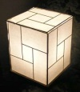
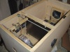

---
author:
    email: mail@petermolnar.net
    image: https://petermolnar.net/favicon.jpg
    name: Peter Molnar
    url: https://petermolnar.net
copies:
- http://web.archive.org/web/20200701204048/https://petermolnar.net/ld50/csinald-magad-pt-8/
lang: hu
published: '2010-08-11T13:07:46+02:00'
summary: Bio-fürdőszobaszőnyeg, lámpák, DIY projector.
title: Csináld magad! pt. 8

---

{.left} **NÖVÉNYEK**. A növényeket
szeretjük *- egyesek csak a virágokat, de az bizony nem szép dolog -*,
mert jó lesz tőlük a levegő, van, aki meg is eszi őket, sőt, olyanis,
aki csak őket. Bár velük nem értek egyet - a csak növényevőkkel -, ilyen
élőlényekkel jó körülvennünk magunkat, szerencsére az ötleteknek nincs
határa, mohát én is próbáltam már otthon tartani, de fura volt a szaga
és sokat kellett locsolni, ez utóbbit megoldja, ha fürdőszoba kilépőt
csinálunk belőle[^1]. *It's alive!* A locsolás állandó gond, azoknak,
akik túlságosan feledékények, a mágnesesség segíthet, elég feltűnő, ha
nem locsol[^2]. Akik viszont nem felejtik el a vizet, azoknak segíség,
ha biztosan nem locsolják túl a növényt, hát olyan asztalt kell építeni,
ami egyfajta automatikus adagoló[^3] - fizika, természetesen, éljen a
párolgás.

{.left}
**LÁMPA**. Az újrahasznosítás jó dolog, de sokszor csak az jut róla
eszünkbe, hogy lehet PET palackból pulcsit csinálni, pedig azt is
jelenti, hogy régi cuccokból kis átalakítással újat kreálni, kémia és
ipar nélkül. Például otthon fellelhető kacatokból lehet japán
hangulatlámpát csinálni[^4], esetleg megmaradt faanyagból asztalit[^5],
ha pedig van otthon döglött mosógéped, mert *miért ne lenne*, akkor a
dob egész jó csillár lehet[^6]. *Annak ellenére, hogy kezdem magam úgy
érezni, mint egy rossz porszívó-ügynök*, ha 2 wattos LED-del[^7]
csinálod, akkor alig fogyaszt, és tényleg zöldnek érezheted magad.

{.left} **PROJECTOR**. A projector jó
dolog, a bulikon is elengedhetetlen a visualhoz, de a boltban kapható
elég drága, pedig mindenki szeretne egyet, aki meg nem, az előbb-utóbb
de. Másokban is felmerült, hogy ezt talán jó lenne olcsóbban megoldani,
hát építettek full HD projectort házilag[^8], az nem teljesen tiszta,
hogy mennyiért, de biztos, hogy megéri.

**Felhívás! Ha elkészítesz valamit az ötletek közül, fényképezd le, vedd
fel, stb., és küldd el!**

[^1]: <http://www.yankodesign.com/2009/01/09/immaculate-mini-lawn-in-your-loo/>

[^2]: <http://www.yankodesign.com/2010/03/02/enemies-of-garden/>

[^3]: <http://www.yankodesign.com/2010/02/16/to-grow-herb-in-da-house/>

[^4]: <http://www.instructables.com/id/5-Japanese-lamp-from-recycled-materials/>

[^5]: <http://www.yankodesign.com/2010/04/19/simple-light-all-wood/>

[^6]: <http://www.yankodesign.com/2010/06/14/this-is-no-dirt-lamp/>

[^7]: <http://www.ledaruhaz.hu/a30197/luxeon_k2_star_led_feher_lxk2-pw14-u00-st>

[^8]: <http://www.lumenlab.com/forums/index.php?showtopic=5230>