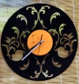
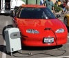

---
author:
    email: mail@petermolnar.net
    image: https://petermolnar.net/favicon.jpg
    name: Peter Molnar
    url: https://petermolnar.net
copies:
- http://web.archive.org/web/20200701204054/https://petermolnar.net/ld50/csinald-magad-pt-9/
lang: hu
published: '2010-08-25T13:10:23+02:00'
summary: Monitorállvány, bakelit-dolgok, elektromos autó és/vagy bicikli.
title: Csináld magad! pt. 9

---

{.left} **MONITOR STAND**. 2010-ben
meglehetősen sokan használnak több monitort, de ehhez hely kell, ha ez
utóbbit csökkenteni szeretnénk, akkor építsünk dual-monitor
állványt[^1], ha pedig az előzőt - értsd, a monitorok számát - növelni,
akkor vegyünk USB-s monitort[^2] , mert abból hatot is tehetünk a gépre,
és még csak nem is olyan drága[^3], mint gondolnánk.

{.left} **BAKELIT ÓRA**. A bakelit
lemez megint trendi, DJ körökben sosem halt ki ugyan, de mi van azzal,
amin mondjuk a Dolly Roll örökbecsű slágerei hallgathatatlanul elkopva
találhatók? Lehet belőle mondjuk órát készíteni[^4]. A linket egyébként
pontosan három nappal azután találtam, hogy a Deák téren rendezett
"design vásár"on pontosan ugyanebbe futottam volna bele, úgyhogy akár
tetszik, akár nem, trend közeleg. Egyébként ott voltak olvasztva
formált[^5] és darabok is, a link mögött csak vágottak vannak. A téren
volt egyébként még döglött biciklibelsőből készült táska[^6], tárca[^7],
öv[^8], stb.[^9], de ugyanilyen anyagból láttam már fürdőruhát[^10] is,
szóval biciklisek, adjátok a halott belsőket a kézműveseknek, hogy
legyen nekik sok pénzük, ugyanis marha drágán adják el őket ezután.
Biciklis alkatrészek további újrahasznosítására meg itt egy pár
ötlet[^11].

{.left} **ELEKTROMOS AUTÓ**.
Meglepődve tapasztaltam a hasznaltauto.hu-n, hogy van elektromos
üzemanyag-kategória, egy kicsit utánanéztem, hogy ez pontosan mit is
takar. Bármilyen meglepő, még kis hazánkban is lehet papírokat és
engedélyeket szerezni házilag átalakított elektromos autóra. Ezt látván
elkezdtem bújni a diy (értsd: do it yourself) oldalakat,\_ de úgy tűnt,
aki ezt kivitelezte, az sokat dolgozott rajta, és annyira nem rajong az
ötletért, hogy megossza másokkal\_. Szerencsére megleltem egy Mazda[^12]
és egy Citroen kacsa[^13] részletes leírását, illetve egy[^14]
(építés)-két[^15] (alkatrész) oldalt, ami a témával foglalkozik
magyarul, esetleg angolul[^16]. Ami kérdéses, hogy mennyire jön ki, és
hogy megéri-e: erre szinte minden oldal azt mondja, hogy rövid távra
(pl. munkába járásra) egyértelműen igen. Az biztos, hogy jobb szag lenne
a városoban, ráadásul a motorok halkabbak is. *Egy kicsit erős csináld
magad!nak,* ezért kétkerekűeknek itt van két link, hogyan lehet egy kis
elektromos hajtással megtolni a biciklit[^17], esetleg mindezt kézi,
akkus fúróból átépítve.[^18]

**Felhívás! Ha elkészítesz valamit az ötletek közül, fényképezd le, vedd
fel, stb., és küldd el!**

[^1]: <http://tnl.iamserio.us/tmp/monitor_stand.htm>

[^2]: <http://www.samsung.com/uk/consumer/pc-peripherals/monitors/notebook-companion/LS22LFUGFY/EN/index.idx?pagetype=prd_detail>

[^3]: <http://ipon.hu/webshop/product/samsung_ld220/114240>

[^4]: <http://www.yankodesign.com/2010/07/14/vinyl-record-clocks-of-many-shapes/>

[^5]: <https://petermolnar.net/>../temp/ld50/meltbakelitclock.jpg

[^6]: <http://www.balkan-tango.com/index.php?site=products&selectedCat=38>

[^7]: <http://www.balkan-tango.com/index.php?site=products&selectedCat=41>

[^8]: <http://www.balkan-tango.com/index.php?site=products&selectedCat=66>

[^9]: <http://www.balkan-tango.com/>

[^10]: <https://petermolnar.net/>../temp/ld50/cherrybombinwear.jpg

[^11]: <http://www.biciklis.hu/spl/297700/Kerekparalkatreszbol_ujrahasznositott>

[^12]: <http://fenykapu.free-energy.hu/pajert/index.htm?FoAblak=>../pajert37/VAAtalakit.html

[^13]: <http://www.evpermanent.com/hu/info3hu.php>

[^14]: <http://www.evpermanent.com/hu/info1hu.php>

[^15]: <http://tech-mobile.hu/termekek-villanymotor.htm>

[^16]: <http://ecomodder.com/blog/a-672-electric-car/>

[^17]: <http://hacknmod.com/hack/diy-30-mph-electric-mountain-bike/>

[^18]: <http://hacknmod.com/hack/make-a-diy-electric-bike-drill-batteries/>