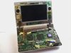

---
author:
    email: mail@petermolnar.net
    image: https://petermolnar.net/favicon.jpg
    name: Peter Molnar
    url: https://petermolnar.net
copies:
- http://web.archive.org/web/20200701204059/https://petermolnar.net/ld50/csinald-magad-s02e01/
lang: hu
published: '2011-02-13T13:21:56+01:00'
summary: IKEA, újraPC, automatizált otthon.
title: Csináld magad! S02E01

---

{.left} **THIS IS SPARTA**, mert ha mindenkinek ugyanaz
kell, akkor olcsóbb, mondja **A Nagy Kék-Sárga Bolt** Az Örsön, Ami
Ellen Sokan Tiltakoztak, Amikor Még Nagyobb Lett, Mint Volt. Ezzel
persze nincs gond, a pénz fontos dolog, jó érzés nem elkölteni mindet,
de ma nem trendi csak egy tojásnak lenni a közös tálcán - és akik ezt
erősen így gondolják, azok vesznek egy fűrészt[^1] is az Ikeában ( nem,
szerintem se vedd itt), egy kicsit ötletelnek, így történnek a
következőkhöz hasonló műalkotások: iMac munkaállomás Lack
falipolcból[^2], falra szerelt, ambient lighttal megtámogatott PC
állomás Besta falikonzolból[^3] (LCD PC-k, Macek előnyben) PAX tolóajtó
térelválasztónak[^4] (szekrény nélkül, Shōji - tudod, a japán rizspapír
ajtók és falak - hangulat), "csillár" Expeditből[^5]. Plusz egy ötlet,
ami nem Ikea-related, de jó: fiókos szekrény cipőtárolásra[^6] (!), hisz
igazából logikus. Persze van, ami már túlmutat a bútor fogalmán\[\^\],
kell hozzá Arduino is, de a végeredmény elég hatásos, az összetevők
szintén a svéd alapokból, és a nembútorok között a legelvetemültebb
azért akkor is a Komplement műanyag dobozából készült softbox[^7]
fotósok sikítsatok, ennél olcsóbb és egyszerűbb tényleg nincs. További
nyalánkságok az ikeahackers.net[^8] oldalon.

{.left} **SZÁMÍTÓGÉP** Volt már szó moddingról,
de az általában annak van, aki mutogatni akarja, aki meg nem, az beépíti
a szekrénybe a gépet,[^9] mondjuk ha ezt moddingnak nevezem, páran nekem
esnek, szóval ez furnituring, és még az előző bekezdésbe is belefér. Ha
már mutogatás, kedvenc téma, mint LED, kombinálva notebookkal, az
ambient lighting for notebook,[^10] ami sötétben látványos, fényben meg
nemszép, de humoros. Ha meg mutogatni akarunk, és láttuk a Minority
Reportot, akkor éljen soká a kinect, mert marha látványosan lehet
csinálni[^11] a bármit. Apropó, a **megunt MacBookot** meg moddolt
tabletté,[^12] mert az trendibb. Ha a megunt cucc nem MacBook, akkor
csak asztali arcade gép[^13]et csinálhatsz belőle, nincs mese.

{.left} **HOME** Otthon, édes otthon, de mindez abban a
korban, amikor a szomszédnak jobb a laptopja, szóval nem lenne rossz
bármikor megnézni az otthon felszerelt kamerákat, meg minden.
Segítségképp: USB otthonvezérlők, smartphone-ról irányítva[^14],
éjjellátó kamera pár masszív infraLED-del,[^15] vagy kőkemény barkács
kinézetű lehallgató,[^16] olyan csúnya, hogy senki sem veszi majd
komolyan, megvan az álca is.

+1 special edition Korábban említett ammodoboz-hangszóró, valaki
készített hozzá útmutatót is,[^17] szóval nyitva az út, getto blaster
for army.

[^1]: <http://www.ikea.com/hu/hu/catalog/products/50079369>

[^2]: <http://www.ikeahackers.net/2011/01/when-imac-goes-to-work.html>

[^3]: <http://www.ikeahackers.net/2010/05/wall-mount-computer-workstation-pc-desk.html>

[^4]: <http://www.ikeahackers.net/2010/10/turn-your-studio-apartment-into-1.html>

[^5]: <http://www.ikeahackers.net/2010/12/lamp-made-of-expedit.html>

[^6]: <http://www.ikeahackers.net/2011/01/shoe-cupboard.html>

[^7]: <http://www.ikeahackers.net/2011/01/camera-flash-soft-box.html>

[^8]: <http://www.ikeahackers.net/>

[^9]: <http://hacknmod.com/hack/build-a-concealed-home-theater-pc/>

[^10]: <http://brunql.github.com/ambilight/>

[^11]: <http://hacknmod.com/hack/minority-report-style-web-browsing-with-the-kinect/>

[^12]: <http://www.enigma-penguin.net/?p=131>

[^13]: <http://hacknmod.com/hack/convert-an-old-laptop-into-a-mini-mame-arcade/>

[^14]: <http://www.instructables.com/id/USB-controlled-home-automation-hack/>

[^15]: <http://hacknmod.com/hack/diy-night-vision-monacle-with-ir-leds/>

[^16]: <http://hacknmod.com/hack/diy-fm-spy-microphone-for-remote-surveillance/>

[^17]: <http://hacknmod.com/hack/diy-portable-ammo-box-speakers/>