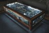

---
author:
    email: mail@petermolnar.net
    image: https://petermolnar.net/favicon.jpg
    name: Peter Molnar
    url: https://petermolnar.netboo
copies:
- http://web.archive.org/web/20200701204104/https://petermolnar.net/ld50/csinald-magad-s02e02/
lang: hu
published: '2011-08-14T13:45:18+02:00'
summary: BurkoltX craft, IKEA 2, circuit board art
title: Csináld magad! S02E02

---

*A rovatom olyan, mint a szárított hal a polcomon: látszik, hogy egy
ideje nem nyúltunk hozzá. Sebaj, olyan ez, mint a Doctor Who 2009-ben,
egész évben 4 special episode, de legalább néha van.*

*És (de, csakazértis mondatot kezdek vele) mivel a tech témák nem mennek
eléggé, gondoltam most lesz kivételesen AHHOZ kapcsolódó téma. Persze LD
stílusban.*

{.left}
**BURKOLTX CRAFT**. Ha már úgyis annyit emlegetem, hogy nem, most sem
*arra* kell gondolni, hát itt egy blog, aminél arra kell gondolni[^1].
Gyengébb idegzetű ~~fetish és SM témakör iránt egyáltalán nem
érdeklődő~~ olvasóinknak nem ajánlott, de van itt például armbinder[^2]
és hood[^3] how-to (az utóbbi 4 rész, ez az első, a többit szerintem meg
lehet találni). Mást nem linkelek, nehogy levágja a biztosítékot. Ha meg
Prágában jársz, ne hagyd ki a Sex Machines Museum[^4]-ot, de a Torture
Museummal ne egy napon legyen, mert úgy túl tanulságos. Amerikában van
Erotic Heritage Museum[^5] is, bár ebben nem jártam, ám a tengerentúlon
még diplomázni is lehet ebből a témából[^6].

{.left} **IKEA.
AGAIN.** Tudom, hogy volt már IKEA hackers[^7], de megunhatatlan;
csodálatos kis apróságokra lehet lelni. Frissen összeköltözötteknek
ajánlott eszköz[^8], hogy a nőnemű díszítőelemei ne legyenek
fellelhetőek mindenhol a lakásban, hasonló azon célból[^9], hogy ne
ugyanezen elemek ne karcoljanak mindent agyon. Ha meg egyszerű
éjjeliszerkrény kell, gót beütéssel[^10] rendkívül occón: pár sarokvas a
sarki fűszerestől, és nehány keretes tükör megoldja. Aki meg nem gót, az
csináljon magának viráglámpát[^11]. Fekete virágból talán mégis gót.

{.left} **ÚJRACIRCUITBOARD**. Az "újrapapír"
és az "újraműanyag" nem ismeretlen, és még csak nem is új fogalmak, de
hála az égnek többen rájöttek, hogy a régi számítástechnikai ( avagy
DEC, Bull, Apricot és egyéb, **tényleg régi**) dolgokból lehet alkotni.
Hogy mit? Mondjuk asztalt. Ilyet[^12]. Meg széket, asztalt (másikat), és
mindent, amit csak eszedbe jut[^13]. ACD/DVD páros újrahasznosítására is
van ötlet, például CD rack CD-ből[^14]. Kicsit mint amikor csontlisztet
kapnak az állatok, de attól még ötletes.

[^1]: <http://fetishleathercrafter.blogspot.com/>

[^2]: <http://fetishleathercrafter.blogspot.com/2011/01/zippered-armbinder-in-patent-leather.html>

[^3]: <http://fetishleathercrafter.blogspot.com/2010/04/making-hood-step-by-step-part-1.html>

[^4]: <http://www.sexmachinesmuseum.com/index.html>

[^5]: <http://www.eroticheritagemuseumlasvegas.com/>

[^6]: <http://en.wikipedia.org/wiki/Institute_for_Advanced_Study_of_Human_Sexuality>

[^7]: <http://www.ikeahackers.net/>

[^8]: <http://www.ikeahackers.net/2009/08/super-simple-girly-hack.html>

[^9]: <http://www.ikeahackers.net/2010/05/jewelry-display-tray.html>

[^10]: <http://www.ikeahackers.net/malma-mirror-nightstand-storage-thingy.html>

[^11]: <http://www.ikeahackers.net/2011/05/flower-light.html>

[^12]: <http://www.unplggd.com/unplggd/inspiration/circuit-board-coffee-table-great-reuse-of-old-tech-122643>

[^13]: <http://hacknmod.com/hack/diy-furnature-from-recycled-circuit-boards/>

[^14]: <http://planetoverhaul.com/2009/03/cd-rack-from-old-cds/>