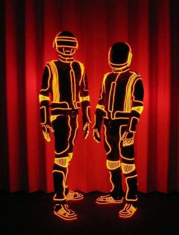

---
author:
    email: mail@petermolnar.net
    image: https://petermolnar.net/favicon.jpg
    name: Peter Molnar
    url: https://petermolnar.net
canonical: http://ld50.hu/article/ld50/napiharom/08-06-23
copies:
- http://web.archive.org/web/20200701204109/https://petermolnar.net/ld50/napiharom-20080623/
lang: hu
published: '2008-06-23T08:13:00+02:00'
title: agyhullámsisak, kék samsung dínó, glowing clothes

---

## No. 1

Future has begun. Mindenki, aki olvasott vagy látott valamit is, ami
cyberpunkkal kapcsolatos, tudja, mi az az implant. Azt is tudja, hogy
veszélyekkel jár.. Valószínűleg a hasonlóan gondolkozók találták ki a
következőt: agyhullámokat feldolgozó sisak.

Az egyetlen baja, hogy - mint az egyik oldal meg is jegyzi - tényleg
hasonlít Magneto sisakjára. Azonban míg az a Professzortól védi
Magnetót, ez írányít egy távirányítós autót az agyhullámainkkal,
legalábbis a németek ezt állítják:
<https://www.youtube.com/watch?v=_LtVLsxoN-M>

Robotirányítás ugyanezzel a módszerrel:
<https://www.youtube.com/watch?v=TQ7EOpPNQyw>

Ha valaki olvasta [**Szergej Sznyegov**
Istenemberek](http://www.szellemlovas.hu/wb_fantasy/index.php?main_page=product_book_info&cPath=1&products_id=1851)
c. művét *(ha nem, tedd meg és meg se próbálj a cím alapján ítélni,
ugyanis a könyv maximálisan pozitív jövőt fest)*, az tudja, milyen
csodálatos lehetőségek rejlenek egy ilyen felfedezés mögött.

Aki meg a világunkban él, tudja, hogy a Nagy Testvér tényleg mindent
látni fog.

via:
[GadgetCom](http://www.gadgetcom.com/german-scientists-develop-nerdiest-brain-computer-interface-yet/)
, source: [golem.de](http://www.golem.de/0806/60547.html)

## No. 2

Mindenki ismer optikai trükköket, és mindenkivel előfordult, hogy nem
akarta elhinni. A Samsung megjelenletett két kis videót: a lényeg a kék
dínó.

<https://www.youtube.com/watch?v=URLRdcnU6Hk>

Egyszer össze kellene rakni valami hasonlót és ugyanígy elvinni
városnézőbe:

Via: [Engadget
Mobile](http://www.engadgetmobile.com/2008/05/17/samsung-soul-promo-video-shows-10-optical-illusions-in-136-secon/),
[Engadget](http://www.engadget.com/2008/06/23/video-samsungs-soulful-dinosaur-takes-tour-around-england/)

## No. 3

Mindenki szeretne neonként világító ruhát. A komplett leírás, hogyan
kell csinálni:
<http://www.instructables.com/id/how-to-add-EL-wire-to-a-coat-or-other-garment/>

Via: [Hack and Mod](http://www.hacknmod.com/displayMOD.php?hack=1526)