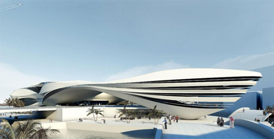
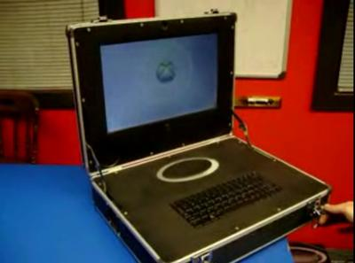
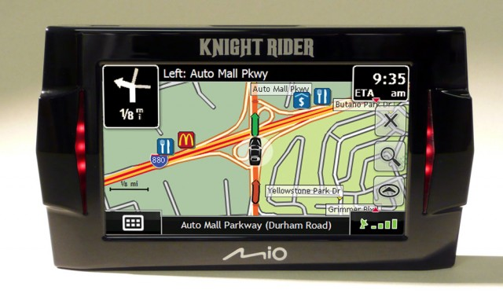

---
author:
    email: mail@petermolnar.net
    image: https://petermolnar.net/favicon.jpg
    name: Peter Molnar
    url: https://petermolnar.net
canonical: http://ld50.hu/article/ld50/napiharom/2008-06-30
copies:
- http://web.archive.org/web/20200701204114/https://petermolnar.net/ld50/napiharom-20080630/
lang: hu
published: '2008-06-30T07:17:00+02:00'
title: Dubai; Xbox notebook; Knight Rider Rise Again

---

## No. 1

Dubai múzeumot tervez, enyhén futurisztikus designnal. Ha jól értelmezem
Dubai terveit, az Aeon Fluxban elkövetett várostervezetet kívánják
megvalósítani. Ha mást nem, remélem tiszta lesz.

Via: [Yanko
Design](http://www.yankodesign.com/index.php/2008/06/23/dubious-dubai-museum/)

## No. 2

Mindig akad olyan, aki nem bírja letenni a játékokat. És mivel a PC-n
való játék éppen nem olyan trendi, készítettek egy hordozható Xboxot.
Beépített képernyő, aprócska billentyűzet. Jee.\
Via:
[GadgetCom](http://www.gadgetcom.com/portable-gaming-solutions-offers-xbox-360-laptops-to-the-daring/)

## No. 3

Igen! Ez AZ, ami az életünkből eddig hiányzott: egy Mio által készített
GPS, ami K.I.T.T hangján és stílusában beszél, és villogtatja a két
oldalsó piros LED-sorát. Via:
[Gizmodo](http://gizmodo.com/5018469/knight-rider-gps-with-kitts-voice)