---
author:
    email: mail@petermolnar.net
    image: https://petermolnar.net/favicon.jpg
    name: Peter Molnar
    url: https://petermolnar.net
canonical: http://ld50.hu/article/ld50/napiharom/2008-07-02
copies:
- http://web.archive.org/web/20200701204119/https://petermolnar.net/ld50/napiharom-20080702/
lang: hu
published: '2008-07-11T13:07:00+02:00'
title: 'Kütyük a jövőből: billentyűzet, gép, lézer'

---

Mindig is vágytam olyan billentyűzetre, ami átlátszik, le lehet mosni,
teljesen mindegy, mivel önti le az ember - és mégsem szilikon. Szép,
elegáns, és futurisztikus. Remélem megvalósul - kár, hogy még csak terv.

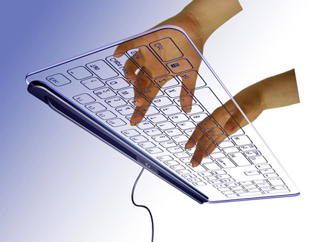
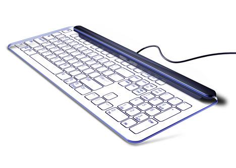

Via: [Yanko
Design](http://www.yankodesign.com/index.php/2008/06/12/lights-camera-glassaction/)

Aki első ránézésre meg tudja mondani, mi ez itt oldalt, az előtt
megemelem a kalapom. Röviden a lényeg: beépített projectoros,
billentyűzetes, optikai meghajtós desktop-laptop hybrid. Inkább
beszéljenek a képek.
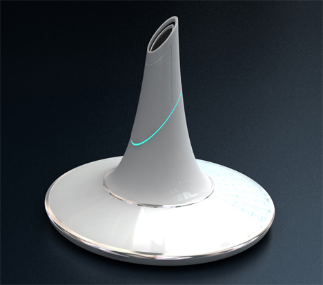
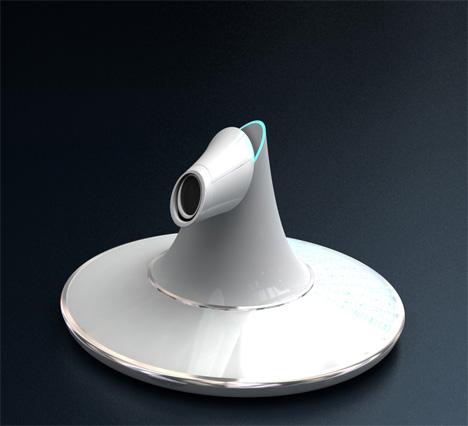
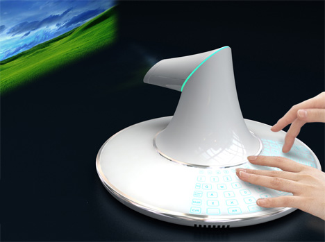
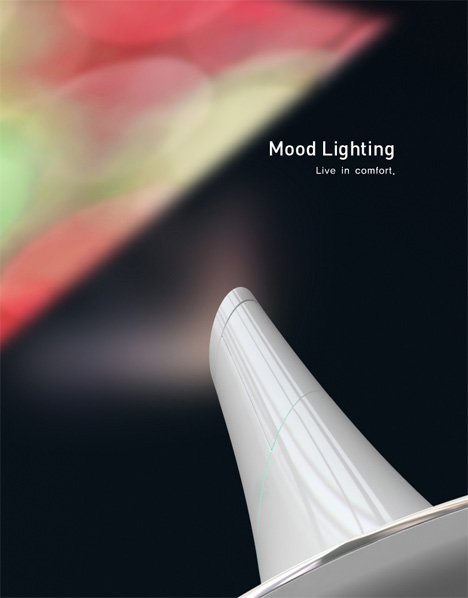
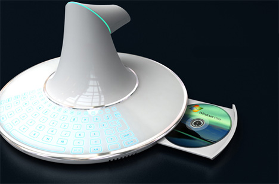
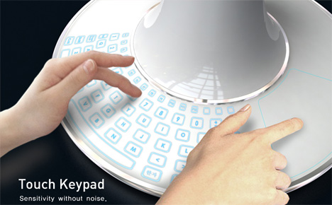

Via: [Yanko
Design](http://www.yankodesign.com/index.php/2008/06/23/laptopdesktop-hybrid/)

A legtöbb kis szórakozóhely híján van profi fénytechnikának - márpedig
anélkül sajnos nem buli a buli. Valószínűleg ez járt annak az embernek
is a fejében, aki 65\$-ért hordozható, programozható lézerprojectort
gyárt, hogy a lehető legteljesebb legyen a buliélmény. Persze ennyiért
motor nincs benne, de egy kis barkács csodákra képes, hogy magától
menjen, esetleg meghatározott frekvenciára reagálva ;)
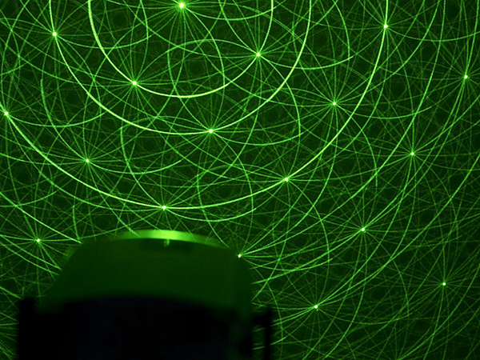
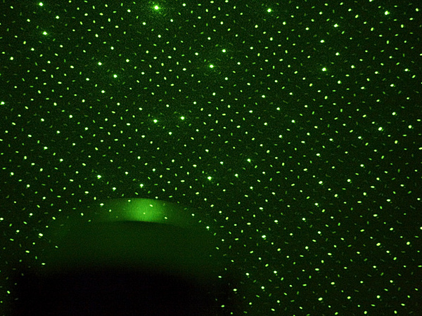
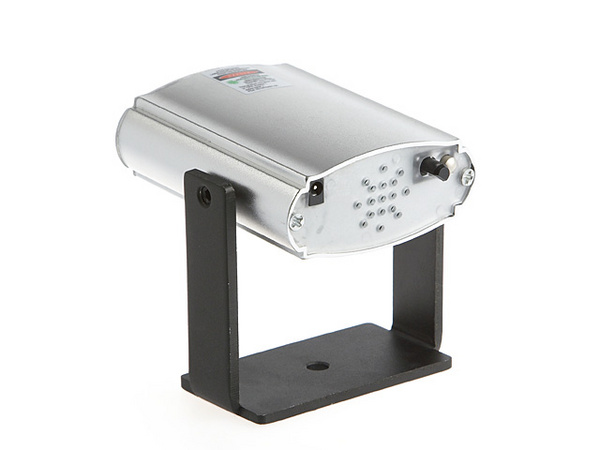
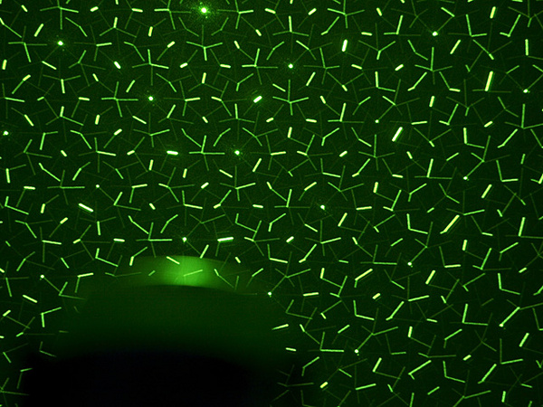

Via:
[Gizmodo](http://gizmodo.com/5018741/brandos-portable-disco-lights-do-it-psychedelically-with-lasers)
