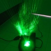
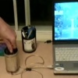
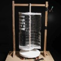

---
author:
    email: mail@petermolnar.net
    image: https://petermolnar.net/favicon.jpg
    name: Peter Molnar
    url: https://petermolnar.net
canonical: http://ld50.hu/article/ld50/napiharom/20080921
copies:
- http://web.archive.org/web/20200701204124/https://petermolnar.net/ld50/napiharom-20080921/
lang: hu
published: '2008-07-22T12:57:00+02:00'
title: Csináld magad!

---

{.left} Mindenki szeretne otthonra saját lézershowt, a
probléma, hogy sokba kerülne.\
Ezek után vajon mi kell ahhoz, hogy 5\$-ból legyen lézershownk? [Pár
lézer-pointer, némi ragasztószalag, pár törött tükör, egy dobozka és egy
lufi.](http://www.gmilburn.ca/2008/06/22/the-five-dollar-laser-show/)\
Kéne készíteni párat a bulikra.

{.left} Az USB az elmúlt pár évtized legjobb
számítástechnikai újdonsága. Főleg, mert mindenre jó. Láttunk már hozzá
kávésbögre-melegítőt, lámpát, ventillátort, és még sok-sok kiváló
ötletet. [Nade USB-s POPCORN készítőt?! Mindezt házilag és
olcsón?](http://www.engadget.com/2008/07/09/diy-usb-popcorn-maker-pops-corn-explodes-your-mind/)
A házimozi kezd teljes lenni.

{.left} Legyünk zöldek! Mármint nem űrlények,
hanem energiatakarékosak: először gyűjtöttük szelektíven a szemetet, a
következő lépés, hogy mini-erőműveket készítünk a Colásüvegből.\
Rendben, kezdetnek csak egy LED-et hajt, de akkor is zseniális :) [Itt
egy PDF leírás a
készítésről.](http://www.re-energy.ca/pdf/wind-turbine.pdf)