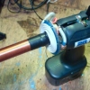
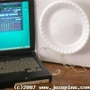

---
author:
    email: mail@petermolnar.net
    image: https://petermolnar.net/favicon.jpg
    name: Peter Molnar
    url: https://petermolnar.net
canonical: http://ld50.hu/article/ld50/napiharom/20081006
copies:
- http://web.archive.org/web/20200701204129/https://petermolnar.net/ld50/napiharom-20081006/
lang: hu
published: '2008-10-06T11:58:00+02:00'
title: Csináld magad! pt. 2

---

{.left} Amikor a steampunk és annak környezete
eszembe jut, nekem a képhez hozzá tartozik egy rendes, láncra fűzött
óra, ami annak idején a tisztes uraknak volt. Hát ezt a képet cáfolja
egy [japán órakészítő
mester](http://pingmag.jp/2008/09/26/haruo-suekichi-the-steampunk-watchmaker/),
aki olyan órákat gyárt, mint a cyber világnak a Tokio Watches -
steampunkban.

{.left} Vannak dolgok, amiket mindig is akartunk.
Ezek közé tartozik a Doom óta a plasma fegyver, amit most mindenki
elkészíthet magának, ha elég őrült. Egy kis forrasztási tudás és némi
alapvető elektronikai ismeret kell csak hozzá, [a többi ezen a kis
oldalon
megtalálható.](http://www.rmcybernetics.com/projects/DIY_Devices/plasma-gun.htm)
Ha már van plasma pisztolyunk, de még nem érezzük késznek a
fegyvertárunkat, akkor készítsünk railgunt! Erre ugye nem a doom, hanem
a Quake óta vágyunk.\
Szebb néven [coilgunnak](http://en.wikipedia.org/wiki/Coil_gun) hívják,
a működési lényege pedig a mágneses gyorsítás. [A lényeg, hogy néhány
agresszív elektromágnessel tényleg működőképes pisztolyt lehet
készíteni](http://hackedgadgets.com/2007/01/27/top-5-coil-guns/), az
egyetlen gond az energia-utánpótlás lesz.

{.left} Túl gyenge a számítógépes hangszóró? [Toldd
meg egy
papírtányérral!](http://www.josepino.com/other_projects/index.php?homemade-hifi-speaker.jpc)\
Nem, nem vicc. A hangszórók membránjának tetemes hányada papírból
készült az elmúlt sok év során, csak mostanában jelentek meg új,
speciális membránok. Ez viszont azt jelenti, hogy aprócska hangszórónkat
kiválthatjuk egy jól megépített papírtányérral - aminek a modularitási
és szállíthatósági képességei bőven felülmúlják a társaiét. Rendben,
kicsit retro hangja lesz, de aki azt szereti, ezt imádni fogja. *(a
linkért köszönet
[Thelleryanior](http://www.ld50.hu/users/Thelleryanior)nak)*