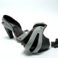

---
author:
    email: mail@petermolnar.net
    image: https://petermolnar.net/favicon.jpg
    name: Peter Molnar
    url: https://petermolnar.net
canonical: http://ld50.hu/article/ld50/napiharom/20081010
copies:
- http://web.archive.org/web/20200701204134/https://petermolnar.net/ld50/napiharom-20081010/
lang: hu
published: '2008-10-10T13:57:00+02:00'
title: Cuccok - elsősorban nőknek

---

{.left} Kellemetlen dolog, amikor a cipő sarka kitörik,
legalábbis nekem minden nő ezt mondta, aki eddig tapasztalta. Mennyivel
egyszerűbb lenne, ha még a sarok kitörése előtt le lehetne azt venni. Ez
a gondolat minden bizonnyal más fejében is megfordult, de ők
továbbmentek: mi lenne, ha az egész cipőt át lehetne alakítani?[^1] Bár
az ötlet zseniális - egy alap, milliónyi kiegészítővel - a cipőgyártók
szerintem inkvizíciót fognak felállítani, ha egyszer egy ilyet gyártani
kezdenek. Kár, hogy férfi cipőben még senkinek sem jutott eszébe.

{.left} Ez egy olyan kapucni, ami igazából egy táska,
de ha álmos vagy, akkor párna.[^2] Hogy mindezt hogyan? Táska úgy, hogy
marha nagy. Kapucni úgy, hogy fel lehet csatolni, és vízálló. Párna
pedig úgy, hogy fel lehet fújni. Szerintem nem lebecsülendő - egy
kiránduláson kifejezetten jól jöhet.

{.left} A bőr fantasztikus anyag, személy szerint
az egyik kedvencem. Ellenben a víz nem tesz neki túl jót, mivel az
egykori gazdája már nem keringeti benne a vért. Ráadásul mindenki jól
tudja, hogy a víztől egy teljesen bőr cipő kitágul és napokig szárad.
Hát erre megoldás egy kis kiegészítő[^3]: gumiból van, színes, és
vízálló. Csak rá kell tenni a cipőre, mint a fapapucsot a hollandoknál.

[^1]: <http://www.yankodesign.com/2008/07/17/mood-shifting-shoes/>

[^2]: <http://www.yankodesign.com/2008/07/14/hooded-up/>

[^3]: <http://www.yankodesign.com/2008/10/08/rugged-high-heels/>