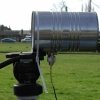

---
author:
    email: mail@petermolnar.net
    image: https://petermolnar.net/favicon.jpg
    name: Peter Molnar
    url: https://petermolnar.net
canonical: http://ld50.hu/article/ld50/napiharom/20081021
copies:
- http://web.archive.org/web/20200701204138/https://petermolnar.net/ld50/napiharom-20081021/
lang: hu
published: '2008-10-21T19:40:00+02:00'
title: WIFI

---

{.left} Gyenge a WiFi-d jele? Vegyél hozzá
antennát! No igen, de az antenna drága dolog, jobb lenne készíteni.
Antennát készíteni viszont nem olyan egyszerű, számításokat és
nyersanyagot igényel. Kivéve, ha konzervdobozból készítjük, egész
meglepő hatásfokkal.[^1] Az eddigi legjobb, amiről azonban nem tudok
referenciát linkelni, egy parabolaantennából épített, 8 km távolságot
átlövő irányított Wireless hálózat volt, de szerintem az nem igazán
legális ;)

{.left} Lopják a neted? Derítsd ki, ki az! Te lopod
más netét? Csak óvatosan! Létezik egy program, ami nem csak a
nemzetbiztonságnak elérhető[^2], és a pontos koordinátáit adja meg
annak, aki lopja a jelet. Kíváncsi vagyok, mobilbemérő programot mikor
ír már valaki.

Amikor a wireless LAN kezdett elterjedni, akkor szerettem volna feltörni
a titkosítást, mert jól hangzott. A gond az volt, hogy linux kellett
volna hozzá, én meg azzal akkoriban nem voltam eléggé jóban. Ezért itt
egy leírás, hogyan lehet pár perc alatt feltörni a WEP titkosítást -
amit még mindig túl sokan használnak - Windows alól.[^3] Érdekes dolog,
hogy sokan azt hiszik, a hackelés minden esetben illegális, pedig nem.
Ha ezeket a módszereket úgy használjuk, hogy azzal pl. egy rendszer
sebezhetőségét vizsgáljuk úgy, hogy erre megbízást kaptunk, vagy a saját
rendszerünk, akkor jó dolog. A jófajta kőagyú főnöknek például így
könnyen és látványosan el lehet magyarázni, miért kell ezközt cserélni.

[^1]: <http://www.turnpoint.net/wireless/cantennahowto.html>

[^2]: <http://securitystartshere.org/page-training-oswa-moocherhunter.htm>

[^3]: <http://tazforum.thetazzone.com/viewtopic.php?f=28&t=6811&st=0&sk=t&sd=a&hilit=wep>