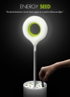
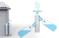
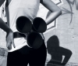

---
author:
    email: mail@petermolnar.net
    image: https://petermolnar.net/favicon.jpg
    name: Peter Molnar
    url: https://petermolnar.net
canonical: http://ld50.hu/article/ld50/napiharom/20081103
copies:
- http://web.archive.org/web/20200701204143/https://petermolnar.net/ld50/napiharom-20081103/
lang: hu
published: '2008-11-04T23:34:00+01:00'
title: Being ZÖLD

---

{.left} Belegondoltál, miért van
az, hogy ha pl. a fényképezőben kimerül az elem, ugyanazzal az elemmel
egy óra miért megy még egy évet? Ha te nem is, más belegondolt, ezért a
következőt ötlötték ki: a kidobott, kimerültnek hitt elemeket az eddigi
"zöld" ládák helyett úgy gyűjtik össze, hogy az elemeket összekapcsolva
ellásson kellő energiával egy energiatakarékos izzót.[^1] Az eredmény:
egy utca lámpa, aminek nem kell elektromos vezeték, mert a beledobált
elemekből megy. A para, hogy nálunk ezt hazavinné mindenki.

{.left} Ha összegyűjtjük az esőt, és
megkérdezzük egy vegyész haverunkat, nem igazán fogja felhasználásra
javasolni, semmilyen formában. Viszont ha úgy gyűjtjük össze, hogy
szépen átszűrjük a megfelelő eszközökkel, akkor már iható is. Házilag
palackozott, finomított víz az ereszcsatornából, ingyen és
bérmentve.[^2]

{.left} Egy illető megtalálta a
legenergiatakarékosabb közlekedési formát: kapaszkodj rá valamire! Igaz,
hogy a növények - ismerős példa az, hogy ragadós galaj? - pár millió éve
használják, mi mégis csak most jöttünk rá, milyen jó is óriási
tapadókoronggal egy autó karosszériáján utazni[^3] Ha valaki lát ilyet,
szóljon, nekem kell.

[^1]: <http://www.yankodesign.com/2008/10/10/trashing-batteries-for-brighter-sidewalks/>

[^2]: <http://www.yankodesign.com/2008/10/30/design-for-poverty-winners/>

[^3]: <http://www.yankodesign.com/2008/09/09/hitch-a-free-ride/>