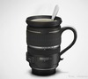

---
author:
    email: mail@petermolnar.net
    image: https://petermolnar.net/favicon.jpg
    name: Peter Molnar
    url: https://petermolnar.net
canonical: http://ld50.hu/article/ld50/napiharom/20090119
copies:
- http://web.archive.org/web/20200701204148/https://petermolnar.net/ld50/napiharom-20090119/
lang: hu
published: '2009-01-19T07:58:00+01:00'
title: Fotós bigyók

---

{.left} **WEBCAM**. Igen nagy az esély rá,
hogy amikor először megláttad a webkamerát, úgy gondoltad, ez életed
legfontosabb eszköze, és **valószínűleg be is szereztél egy igen trágya
felbontású**, már akkor is gyér **device-t**. Ha ez nem így történt,
örülj, mert nem dobtál ki pénzt, ha viszont igen, és mégis szeretnéd
valamire használni, kövesd dennison példáját[^1]. Röviden és tömören
leírja, hogyan tegyünk rá egy rendes **teleobjektívet** egy dobozra,
amibe a webcam nyers CCD-jét tettük. Meg lehet vele lesni a szomszéd
maláj kurvát. via: <http://blog.dennisonbertram.com/%5B%5E2%5D>

{.left} **TILTSHIFT**. Vannak olyan
dolgok, amikért a gyártók pénzt kérnek. Sok pénzt. És vannak emberek,
akik ezt nem szívesen fizetik ki. Az ilyenek nekiállnak barkácsolni,
hátha lesz belőle valami. Az előbb már említett úriember drágállotta a
tilt-shift lencsékért kért összeget, úgyhogy WC pumpából, vázsapkából és
egy középformátumhoz való obiból[^2] csinált magának egyet. Nyilván
kicsit alulmúl funkcionalitásban egy eredetit, de egy WC pumpából
készült objektív nélkül nem fotós a fotós. via:
<http://blog.dennisonbertram.com/%5B%5E4%5D>

{.left} **TÖNKREMENT**. Amikor végérvényesen és
teljesen tönkremennek dolgaink, nyugati testvéreink kidobják azokat,
hisz lehet újat venni. Mi, keletiek nem. Minket valami másra tanítottak,
arra, hogy minden jó lesz még valamire. Így ha valakinek tönkremegy egy
teleobjektíve, semmi gond. Némi sziloplaszt, egy fül egy másik
tönkrement tárgyról, és van kávésbögrénk objektívből.[^3] Persze, hogy a
kép egy egy ügyes PS trükk, de én szívesen rohangálnék egy ilyennel. (a
képért köszönet ladymucur[^4]nak ) via:
<http://tebe-interesno.livejournal.com/%5B%5E7%5D>

[^1]: <http://blog.dennisonbertram.com/hackmaster/2005/02/webcam-telescope.htm>

[^2]: <http://blog.dennisonbertram.com/hackmaster/2005/02/tilt-shift-pc-lens.htm>

[^3]: <http://tebe-interesno.livejournal.com/84790.html>

[^4]: <http://ld50.hu/users/ladymucur>