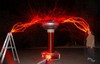
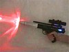
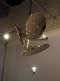

---
author:
    email: mail@petermolnar.net
    image: https://petermolnar.net/favicon.jpg
    name: Peter Molnar
    url: https://petermolnar.net
canonical: http://ld50.hu/article/ld50/napiharom/20090125
copies:
- http://web.archive.org/web/20200701204153/https://petermolnar.net/ld50/napiharom-20090125/
lang: hu
published: '2009-01-26T02:56:00+01:00'
title: Fény

---

{.left} Mindig is tudtuk, az őrültek köztünk járnak.
Egyedül csak az nem mindegy, hogy ez az őrület ártalmas-e vagy sem. A
Tesla Coil Gallery[^1] első ránézésre nem tesz jót. Figyelembe véve,
hogy a Tesla szóról sokaknak nem a váltóáram "feltalálója" jut eszébe,
hanem a Red Alert tornya, ez teljesen jogosnak tűnik Valójában teljesen
ártalmatlan pár ezer voltról beszélünk, amit ilyen[^2] és olyan[^3]
csoportok látvány léterehozására használnak, nem is rosszul. A képeken
semmi manipuláció nincs. via: hacknmod.com[^4]

{.left} Home made lézershow[^5] már
volt, de a lézer ennél sokkal több dologra alkalmas. Lehet belőle
például lézerpisztolyt csinálni otthon[^6]. Ez pontosan ugyanolyan, mint
gyerekkorunk vinnyogó-szirénázó-villogó pisztolya, attól eltekintve,
hogy\*\* ebből tényleg lézer jön.\*\* Már csak mögé kell képzelni a
rohamosztagost, és osztani a népeket, aki pedig nem tudja, miről
beszélek, olvasson D&D játékosoknak írt Star Wars képregényt.[^7] Nincs
via.

{.left} A világítás fontos. Nélküle az éjjeli
baglyok kénytelenek lennének gyertyafény mellett netezni, ami bár
**gót**, szerintem nem jó. Próbáltam. Azonban ha a fény nem elég szórt,
bántja a szemet. A logikát követve, ha van olyan eszközünk, ami
elektromágneses sugárzást **koncentrál**, akkor ezt a folyamatot **meg
lehet fordítani**. Hát így lesz[^8] spot lámpából és kimustrált,
újrafényezett parabolaantennából világítótest. via:
todayandtomorrow.net[^9]

[^1]: <http://www.hacknmod.com/hack/tesla-coil-picture-gallery-high-voltage/>

[^2]: <http://www.teslasystems.com/gallery/index.html>

[^3]: <http://tesladownunder.com/>

[^4]: <http://www.hacknmod.com/hack/tesla-coil-picture-gallery-high-voltage/>

[^5]: <http://www.gmilburn.ca/2008/07/21/the-ultimate-home-laser-show/>

[^6]: <http://www.instructables.com/id/Make-an-LED-Blaster/>

[^7]: <http://www.darthsanddroids.net/episodes/0001.html>

[^8]: <http://www.todayandtomorrow.net/2008/11/03/satellite-chandelier/>

[^9]: <http://www.todayandtomorrow.net/2008/11/03/satellite-chandelier/>