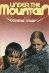

---
author:
    email: mail@petermolnar.net
    image: https://petermolnar.net/favicon.jpg
    name: Peter Molnar
    url: https://petermolnar.net
canonical: http://ld50.hu/article/ld50/napiharom/20090229
copies:
- http://web.archive.org/web/20200701204208/https://petermolnar.net/ld50/napiharom-20090229/
lang: hu
published: '2009-03-01T20:39:00+01:00'
title: 'Napi három: 2009.02.29.'

---

{.left} **MIXXX**. Voltak idők, amikor nem tudtunk
ellenni olyan oldalak és programok nélkül, mint az astalavista[^1] -
ekkor ugyanis még nem, vagy alig létezett open-source[^2] közösség, és
mindent crackelni kellett. Mára annyian csatlakoztak hozzá, hogy szinte
minden programnak van ingyenes változata. Persze némi lemaradással és
kevesebb funkcióval, mint a kereskedelni változat, de akkor is
legálisan, ingyen. Ilyen többek között a Mixxx[^3] is: nyílt, ingyenes
DJ program. Persze, a Traktorhoz vagy Virtual DJ-hez szokott szemnek
buta. Előnye viszont, hogy meglehetősen gyors, az alapokra bőven elég,
és határozottan jobb erre a célra, mint pl. a Winamp. Ellenben
döbbenetesen ronda az alapskin. A többi is.

{.left} **VJ**. A VJ-k művészete nem egyszerű, hiszen a
hang mellett még a videót is keverni kell. Emiatt bizony nem feltétlenül
látványos elemei a színpadnak, sokszor inkább a háttérből tárják a
közönség elé kreálmányukat. Mindkét problémán enyhíthet egy eszköz, ami
kéz- és lábmozgással is vezérli a videó vágást: egyrészt több végtagot
fog tudni használni, másrészt jól néz ki. Kíváncsi vagyok, látni fogok-e
valaha ilyet. via: yankodesign.com[^4]

{.left} **ELFELEDVE**. Egyszer
volt, hol nem volt, kicsik voltunk, általános iskolások, és megjelent
egy sorozat, ami vasárnap délelőtt volt, a rajzfilmek után. Azt hiszem,
nem tévedek, hogy a legtöbbünkben a fekete, szörcsögő szörnyek maradtak
meg belőle, a két színes (egy piros/naracssárga és egy kék) tojás, amit
a gyerekeknek kellett szorongatniuk, de a fiú elejti, és majdnem minden
elveszik. Igen, bizony, AZ a sorozat, ami 6-7 évesen megtanította az
embert arra, hogy ne igazán legyen képes megijedni a szörnyektől. Talán
az Aliens az egyetlen kivétel[^5], no meg Lovecraft írásai, de minőségi
film még nem készült belőlük. A címe A hegy gyomrában volt, és a
youtube-on megnézhető[^6]. Szerintetek hányas karika járna ma érte?

[^1]: <http://astalavista.box.sk/>

[^2]: <http://sourceforge.com/>

[^3]: <http://www.mixxx.org/>

[^4]: <http://www.yankodesign.com/2009/02/20/vjs-could-probably-be-ddr-champions-with-this/>

[^5]: <http://www.imdb.com/title/tt0090605/>

[^6]: <http://www.youtube.com/watch?v=nUs0NByjEh8>