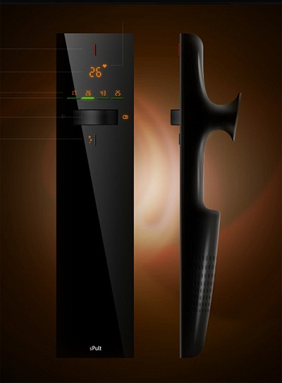
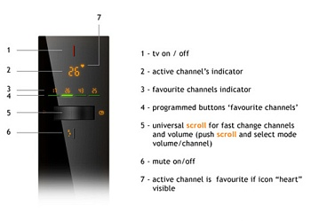

---
author:
    email: mail@petermolnar.net
    image: https://petermolnar.net/favicon.jpg
    name: Peter Molnar
    url: https://petermolnar.net
canonical: http://ld50.hu/article/ld50/tech/futuretaviranyito
copies:
- http://web.archive.org/web/20200701204218/https://petermolnar.net/ld50/tech-futuretaviranyito/
lang: hu
published: '2008-06-21T13:14:45+02:00'
summary: Túl sok gomb van a távirányítódon? Na ezen tuti nem.
title: 'A jövő távirányítója: a kevesebb több'

---

*Ez egy kísérleti cikk: páran még emlékezhetnek, hogy voltak itt
mindenféle kütyük, izék és bigyók időnként. Mivel nekem ezek hiányoznak,
hát gondoltam megpróbálok néha egy pár ilyet hozni.* Tegyétek ezt ti is,
több szem többet lát!

Yurii Smitana Perfilov[^1] designernek eszébe jutott tervezni egy olyan
távirányítót, ami programozható, szép és nincs rajta, csak annyi gomb,
amennyi feltétlenül szükséges. Úgy működik, hogy a gombbal kiválasztod a
funkciót, a görgő segítségével pedig változtatod.

Persze ezzel elmarad a megszokott távkapcsoló-érzés, de nem illik sokkal
jobban a plazma/LCD képernyő mellé?

Via: Yanko Design[^2]

[^1]: <http://www.smitana.ru/>

[^2]: <http://www.yankodesign.com/index.php/2008/06/20/new-hotness-less-is-more/>