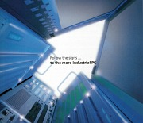
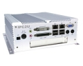
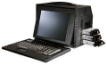
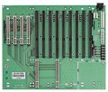
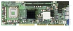
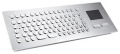

---
author:
    email: mail@petermolnar.net
    image: https://petermolnar.net/favicon.jpg
    name: Peter Molnar
    url: https://petermolnar.net
canonical: http://ld50.hu/article/ld50/tech/industrialpc
copies:
- http://web.archive.org/web/20200701204223/https://petermolnar.net/ld50/tech-industrialpc/
lang: hu
published: '2007-12-22T16:18:21+01:00'
summary: 'Industrial: zene, gyárak, ipar, Csepel Művek, loft lakás - pedig
    a hi-tech, a nagyon drága fejlesztések és fantasztikus ötletek világa
    is ugyanez. PC: ilyenje mindenkinek van. Vagy ha nem, hát előbb-utóbb
    lesz. Képzeljük magunkat valamelyik sci-fibe; teljesen mindegy, hogy az
    a Gattaca sterilsége, vagy a Blade Runner savas esője, rögtön észrevesszük,
    hogy jelenlegi PC-nk nem ide termett - az industrial PC-k viszont igen.'
title: Industrial PC-t mindenkinek!

---

{.left} Az industrial ebben az esetben maximálisan a
hi-techre értendő. A közelmúltban jártam egy kiállításon Németországban,
erre a területre is specializáltan - közel három BNV-nyi területen. Az
kell, hogy mondjam, az ipar jelenlegi értelmének nem sok köze van ahhoz,
ami a nyelvterületünkön eszünkbe jut róla. A Csepel Művek rusztikus
hangulata mára a múlté: már-már Star Trek stretilségű, tiszta, teljesen
automatizált gyárak, végtelen gyártósorok, fehér, fényes folyosók,
egyenruhás, halk emberek.

Az mindenkinek ismerős, hogy ami új, az általában drága. Emellett ezen a
területen van rengeteg dolog, amire a közszférában nincs szükség,
például az IP65-ös védelem, ami nagyjából azt jelenti, hogy zuhanyzáshoz
is magaddal viheted a cuccot. Mindezek ellenére igenis vannak olyan
dolgok, amiknek szép lassan illene átszállingóznia az átlagember által
elérhető területre. Node, hogy ne a levegőbe beszéljek, álljon itt pár
példa.

{.left} **Fanless PC[^1]** Elsőként a
személyes kedvenc: pici és teljesen csendes, ugyanis a gépház hűt, nincs
benne semmilyen ventillátor. Alumínium vagy speciális ötvözet házak,
külső hűtőbordák, elfuserált méretű alaplapok és kellemesen meleg a
gépház jellemzi őket. Hátrány, hogy tényleg csak a hozzájuk tervezett
alaplapokat lehet beléjük tenni, viszont nagyon kicsik is tudnak lenni -
amellett, hogy a legtöbb falra szerelhető négy csavarral. A
technológiáról elég annyi, hogy heatpipe-os megoldásokat használ
mindenre, egy notebook-szerű külső tápegységgel kap áramot, de az is
csendben van. Így tehát az egyetlen hangforrás a merevlemez, de a 2,5"
vagy 1,8" diskek már elég halkak. (A jelenlegi legerősebb core2duo-t
fogad, általában mobil változatot).

{.left} **Portable Workstations[^2]**
Sokan nem tudják, mi a különbség a "mobil" és a "hordozható" elnevezés
között. Nos, a következő kis szépség egyértelműen a hordozható
kategória: van rajta fogantyú, van beépített monitora, billentyűzete.
Azonban annak ellenére, hogy alumínium ötvözet a háza, 17 kg-ot nyom,
tehát egy idő után kicsit lehúzza az ember kezét.

{.left} Persze, mint minden ebben a műfajban, ez sem
egy sima PC[^3]: olyan alaplapot eszik, ami szabványos, de néha kevésbé
ismert BUSokkal van ellátva, és más semmi sincs benne. Ezekbe a BUSokba
kell elhelyezni mindent, kártyák formájában - a CPU-t és az összes
vezérlőegységet is. Egy ilyen rendszer értelme abban rejlik, hogy több
CPU kártyát (ld. lejjebb) is bele lehet helyezni, párhuzamosítani lehet
őket, és így egy gépen belül akár több, egymástól független gép, vagy
néhány dolgot közösen használó gép (pl. merevlemez) alakítható ki.

{.left} **CPU kártya[^4]** Az előbb
említettem egy olyat, hogy CPU kártya, ez számomra az egyik
legérdekesebb jelenség, amivel a számítástechnikában találkoztam. Egy
olyan kártyáról van szó, ami egyetlen (pl. PCI) BUSszal kapcsolódik egy
alaplaphoz, és van rajta minden, amit nem szégyelltek rátenni. Egy vagy
több processzor, memóriafoglalat, VGA, ethernet, soros port, USB port,
másfajta port, IDE és/vagy SATA és/vagy SCSI vezérlő, (néha ezek
RAIDben), tehát egy teljesen komplett kis számítógép egyetlen kártyán. A
legszebb az egészben, hogy az PC-s BUSszal szereltek semmilyen extrát
nem igényelnek, bármilyen, megfelelő perifériával ellátott gépbe be
lehet tenni - tehát egy P2est is fel lehet vele "kicsit" húzni, ha
otthon porosodik.

{.left} **Embedded systems[^5]** Az industrial PC
fogalma elég szorosan kötődik egy másik világhoz, az embedded systems,
tehát a beágyazott rendszerek tárgyköréhez. Ezek az olyan ezközök, mint
az internet kioskok a metróban (a Blahán van például): előre szerelve az
egész, csak oda kell tenni, és működőképes. Ehhez speciálisan
kialakított alkotóelemek kellenek, amiket kifejezetten a szokatlan
igényekhez készítenek. Például az ilyenekhez van a képen látható,
egészen speciális billentyűzet: rozsdamentes acélból készül, egybe van
építve egy tapipaddal, kibírja, ha kiteszik az esőbe, ráadásul szép is
és nincs az a műköröm, ami elkoptatja. Venezuelában az esőerdőben és a
Szaharában ugyanúgy bírja, szinte biztos, hogy egy jobbfajta atomháború
utáni sivatagba elkell majd egy-egy ilyen. A téma még igen sok mindent
fed, a LED kijelzőktől kezdve a speciális hűtőkig. Többek közt van
például LCD panel, csak úgy, önmagában, így a steampunk monitor[^6]
készítéséhez nem kell szétszednünk semmit :)

Ha valakit érdekel a téma errefele nézelődjön:

-   <http://www.ipc2u.com/>
-   <http://www.kontron.com/>
-   <http://www.indukey.com/>

[^1]: <http://www.ipc2u.com/catalog/E/EC/37304.html>

[^2]: <http://www.ipc2u.com/catalog/R/RM/28546.html>

[^3]: <http://www.ipc2u.com/catalog/B/BG/13795.html>

[^4]: <http://www.ipc2u.com/catalog/P/PG/37473.html>

[^5]: <http://www.ipc2u.com/catalog/K/KE/34702.html>

[^6]: <http://steampunkworkshop.com/lcd.shtml>