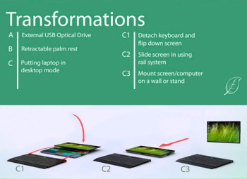

---
author:
    email: mail@petermolnar.net
    image: https://petermolnar.net/favicon.jpg
    name: Peter Molnar
    url: https://petermolnar.net
canonical: http://ld50.hu/article/ld50/tech/modularisnotebook
copies:
- http://web.archive.org/web/20200701204228/https://petermolnar.net/ld50/tech-modularisnotebook/
lang: hu
published: '2008-10-18T13:02:45+02:00'
summary: Az innováció jó dolog, főleg, ha tényleg hasznos dologgal áll elő.
    És lőn, moduláris notebook. Sajnos még csak terv. Már csak a 3D kijelző
    kell hozzá és teljes az élmény.
title: Moduláris notebook

---

{.left} Mindig is szerettem a jövő számítógépére
vonatkozó elképzeléseket. Ha csak néhány filmen vagy könyvön
végigtekintünk - Aeon Flux, Star Trek, stb. - a legszembetűnőbb, hogy
mind elegáns, szép és a kijelző lebeg a levegőben. *Persze emellett
észrevehetjük, hogy a filmalkotók által elképzelt jövőben a legtöbb
esetben PDA-szerű ezközök vannak az egyes személyeknél, és centralizált,
központi számítógépek a többi feladatra, de ez már egy másik kérdés.*

Az egyik legelterjedtebb elképzelés a levegőben lebegő, sokszor 3D
megjelenítő. Ezekre most is rengeteg terv van[^1], kérdés, hogy vajon
melyik az, ami majd áttöréshez vezet. Szerintem a forgatott tükör alapon
működő már most működőképes[^2], igaz nem tudom, mennyire hangos.

A megjelenítő azonban csak a gép egy része, hiszen rendelkeznie kell még
rengeteg más képességgel is. Az egyik kedvencem a tollakból álló gép
ötlete volt.\
Nem tudom, mevalósította-e valaki, hiszen mára egyáltalán nem lehetetlen
az elképzelés: kivetített billentyűzet már van[^3], wireless USB már
van[^4], pendrive meg már régóta van.
{.left}{.left}
{.left}

Nemrég megjelent egy ezeknél sokkal konzervatívabb, mégis ígéretes
ötlet: moduláris notebook. Minden notebook tulajdonos tisztában van
vele, hogy a gépe nem áll a fejleszthetőség csúcsán. Az egy dolog, hogy
a minél-kisebb-annál-drágább elv miatt vastag pénztárca kell hozzá,
sokszor hiába lenne meg a pénz: a gép úgy van összerakva, hogy semmi sem
cserélhető benne. Ezért egy innovációs csapat egy olyat ötletet mutatott
be ami hasonló a multibay elvéhez, azonban a gép összes alkatrészét így
építené be.\
Azt hiszem, ennek az előnyeit nem kell ecsetelnem, beszéljenek inkább a
képek.

 
 

Ezek után kíváncsi vagyok, megvalósítja-e valamelyik gyártó, és ha igen,
akkor mikor.

[^1]: <http://en.wikipedia.org/wiki/3D_display>

[^2]: <https://www.youtube.com/watch?v=FF1vFTQOWN4>

[^3]: <http://www.celluon.com/index.html>

[^4]: <http://en.wikipedia.org/wiki/Wireless_usb>