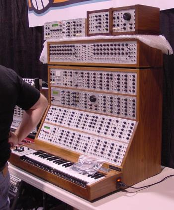
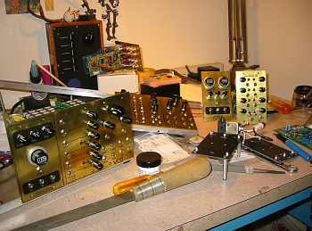

---
author:
    email: mail@petermolnar.net
    image: https://petermolnar.net/favicon.jpg
    name: Peter Molnar
    url: https://petermolnar.net
canonical: http://ld50.hu/article/ld50/tech/steampunksynth
copies:
- http://web.archive.org/web/20200701204233/https://petermolnar.net/ld50/tech-steampunksynth/
lang: hu
published: '2008-06-22T21:36:57+02:00'
summary: Igen, ez tényleg egy analóg (tehát analóg generátor, analóg jellel,
    digitális átalakítás nékül) szintetizátor, analóg torzításokkal és billentyűvel,
    sárgaréz burkolattal.
title: Analóg moduláris szinti - steampunk köntösben

---

{.left}

Aki nem tudja, mi az, hogy moduláris szinti: Amikor régen az olyan
nevek, mint Tangerine Dream[^1], Klaus Schulze[^2], Jean-Michell
Jarre[^3] megjelentek, velük együtt jelent meg a szintetizátorok egy
teljesen új generációja. Röviden összefoglalva ezek olyan szerkezetek,
amik különálló egységekből és egy jelgenerátorból voltak képesek
teljesen egyedülálló hangot kiadni magukból. Igazából minden egyes
potméter megtekerésekor egy új hangszer képződött: ezeket a hangokat
ugyanis rá lehetett vezetni egy elektronikus zongorára.

És hogy miért volt ez jó? Mert összefüggő, teljesen analóg hangképet
adott, ellentétben digitális társaikkal, amik - bár később erősen
kiszorították az analóg szintiket - a digitális átalakítás miatt
kizárólag mintavételezett jelet képesek kiadni magukból.

Azonban ezek a szintik - mint pl. a legendás Moog III[^4] - sosem tűntek
el teljesen, sok stúdió a mai napig használja őket. Van viszont egy
komoly bajuk: az elmúlt pár évtizedben a Casio és társai jóvoltából
beszerezhetetlenek voltak, a kis példányszám miatt irreálisan drágán
lehetett hozzájuk jutni.

A Moog III-ból azóta készült digitális változat[^5], állítólag jó
teljesítménnyel - a szemlélet viszont biztos, hogy elveszik vele.

{.left}

Egy szó, mint száz: egy steampunk őrült barkácsolt magának egy
hangszert[^6], ami beleillik Verne regényeibe, hisz ilyet nem talált;
van video is[^7]

[^1]: <http://www.tangerinedream.org/>

[^2]: <http://www.klaus-schulze.com/>

[^3]: <http://www.jeanmicheljarre.com/>

[^4]: <http://www.jarrography.free.fr/details_equipement_audio.php?id_equip=115>

[^5]: <http://sydney.gumtree.com.au/c-Stuff-for-Sale-musical-instruments-MINI-MOOG-MINIMOOG-V-SOFTSYNTH-WORKS-ON-MAC-PC-W0QQAdIdZ57085567>

[^6]: <http://steampunkworkshop.com/jules-vernian-analog-synthesizer>

[^7]: <https://www.youtube.com/watch?v=j_ZMV19LpSM>