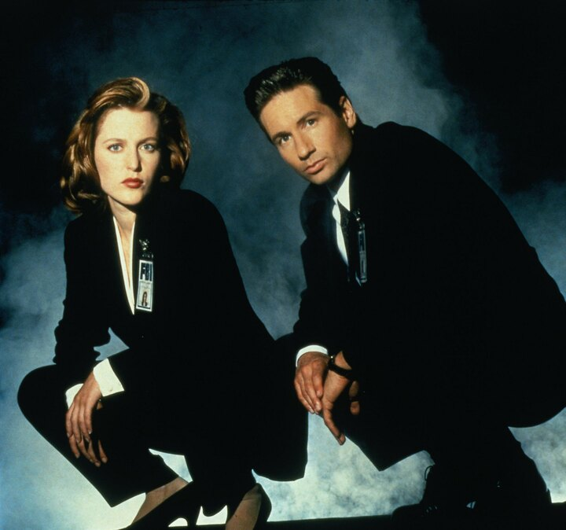

---
author:
    email: mail@petermolnar.net
    image: https://petermolnar.net/favicon.jpg
    name: Peter Molnar
    url: https://petermolnar.net
copies:
- http://web.archive.org/web/20190809093226/https://petermolnar.net/stranger-things-season-3-lacking-elements/
published: '2019-07-16T18:00:00+01:00'
tags:
- TV
title: Why Stranger Things Season 3 doesn't work as Season 1 did

---

Season 1 of Stranger Things became a world-wide phenomenon. It kicked
off a whole wave of music - neon/retrowave - and made everything
dripping with 80s nostalgia.

Season 2 still more or less worked, but for my taste, it was way too
X-Men, especially with the phoenix-like ending. Then Season 3 happened.
It that barely works and it's solely for US nostalgia.

The absolute ingenuity of Season 1, in my opinion, that it was never
really clear if the Demogorgon was Eleven's subconsciousness or not; a
manifestation of her powers and fears.

Back in the early 90s there was another series which worked across the
whole world. It had:

-   government secrets
-   mystical and/or alien elements
-   inexplicable events
-   shady forces in the background
-   investigation
-   terrifying unknowns, resulting in the type of fear you get from Poe
    or Lovecraft

Sounds familiar? Yes, I'm talking about the X-Files.

Stranger Things Season 1 followed a very similar playbook. Shady
government experimenting on children; a weird, mysterious world; a
single, quite well done monster; investigation from multiple angles from
multiple groups of people with different style to solving their own
corner of the same mystery. Plus 80s. The X-Files was early 90s, so the
80s vibe hadn't faded completely.

In contrast, Season 2 and 3 of Stranger Things:

-   barely any mystery - so the monster was not a result of Eleven's
    powers
-   lots of not too original monsters - demodogs? bad cgi Cronenberg
    monster?
-   a nice government (!) who actually sends help - that was a
    cornerstone in the whole attitude, that the government is against
    the protagonists
-   simple, fast investigations - no more real mystery any more
-   too many deliberate references to 80s phenomenons - I get it,
    movies, music, etc, but this needs to a supporting feature in the
    background, not a plot device
-   USSR is bad, mmkay, kids? - hundreds of meters secret tunnels out of
    a sci-fi movie built by Russians during the cold war in the US,
    suuuuure

If there will be a Season 4, and if anyone wants it to be a success,
they'd really need to go back to the rulebook of Season 1.