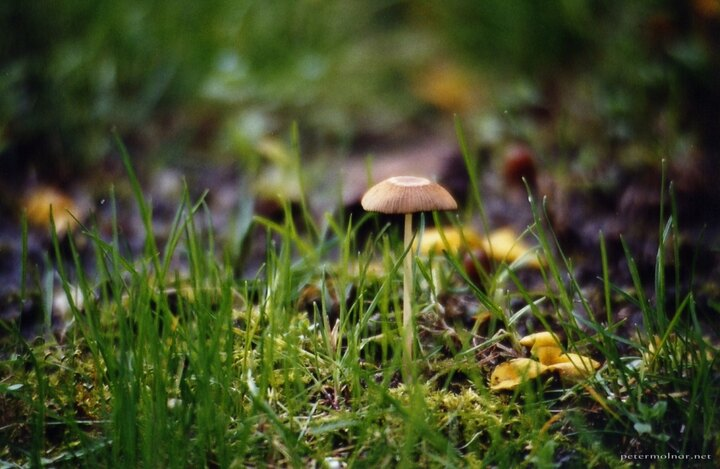

---
author:
    email: mail@petermolnar.net
    image: https://petermolnar.net/favicon.jpg
    name: Peter Molnar
    url: https://petermolnar.net
copies:
- http://web.archive.org/web/20200923080339/https://petermolnar.net/photo/1-gomba/
published: '2005-04-26T16:10:00+02:00'
tags:
- mushroom
- analog
- film
- bokeh
title: Gomba

---

Over 15 years ago I took photography course. This picture was made with
a Contaxt RTS, on analog film, with a surprisingly cheap push/pull zoom
lens, and I still love the outcome.