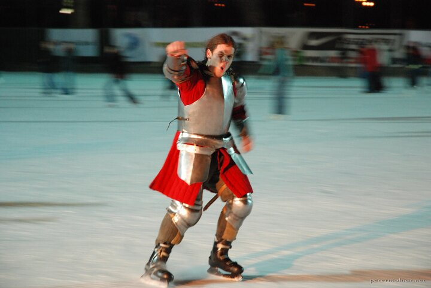

---
author:
    email: mail@petermolnar.net
    image: https://petermolnar.net/favicon.jpg
    name: Peter Molnar
    url: https://petermolnar.net
copies:
- http://web.archive.org/web/20200923080340/https://petermolnar.net/photo/500-years/
published: '2008-01-24T22:25:41+00:00'
tags:
- warrior
- ice skating
- armour
- medieval
title: 500 years

---

Legend says King Matthias was crowned on the ice of the Danube -
háromszor repült az korona az égbe / háromszor szállt rája, Mátyás szép
fejére. 500 years later our group, Mare Temporis, was invited to do some
performances; this time, on ice. If anyone ever wondered if ice-skating
is possible in armour: it is.