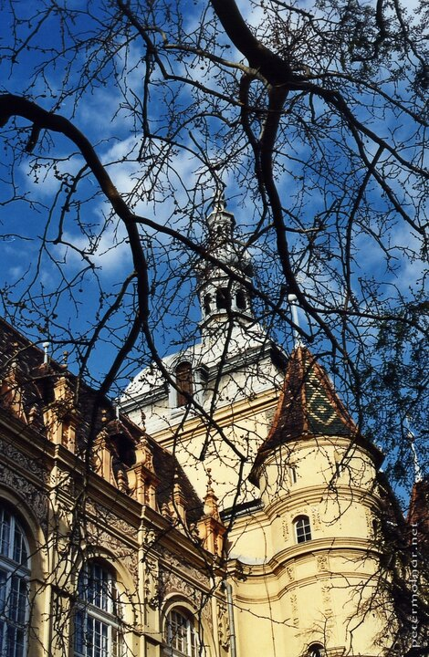

---
author:
    email: mail@petermolnar.net
    image: https://petermolnar.net/favicon.jpg
    name: Peter Molnar
    url: https://petermolnar.net
copies:
- http://web.archive.org/web/20200923080342/https://petermolnar.net/photo/a-la-kepeslap/
published: '2005-04-26T16:00:00+02:00'
tags:
- castle
- Hungary
- Budapest
- analog
title: Vajdahunyad Vára

---

Over 15 years ago I decided to take a photography course to put an end
to the mess I had in my head about the technical part. This picture as
made with a Contaxt RTS, on analog film, part of the studies. The Castle
on the picture is a part the Castle Vajdahunyad in Budapest.