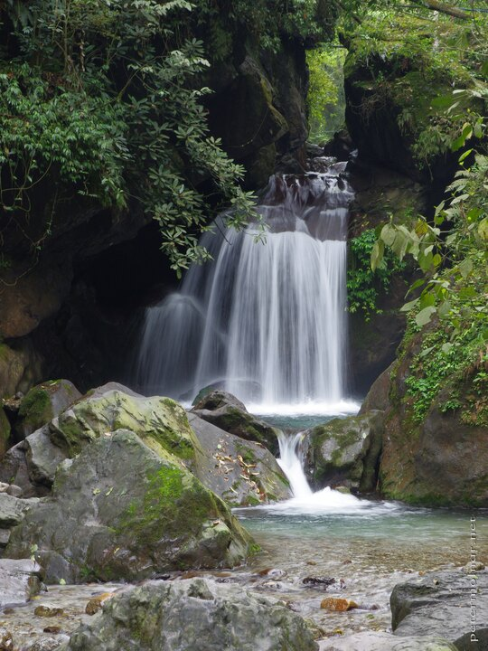

---
author:
    email: mail@petermolnar.net
    image: https://petermolnar.net/favicon.jpg
    name: Peter Molnar
    url: https://petermolnar.net
coordinates:
    latitude: 29.573397
    longitude: 103.392060999922
copies:
- https://www.flickr.com/photos/36003160@N08/27801842780
- http://web.archive.org/web/20190624125130/https://petermolnar.net/a-waterfall-near-qingyin-pavilion/
published: '2016-07-01T08:00:47+00:00'
syndicate:
- https://brid.gy/publish/flickr
tags:
- Sichuan
- Qingyin Pavilion
- stream
- green
- forest
- Mount Emei
- Emeishan
- waterfall
- nature
- China
- water
title: A waterfall near Qingyin Pavilion

---

Qingyin Pavilion it a fairly central point at Emei Mountain: 4 main
routes merge here, and it's also the closest place to go and see monkeys
from.

It also hosts numerous small/medium waterfalls, such as this one.