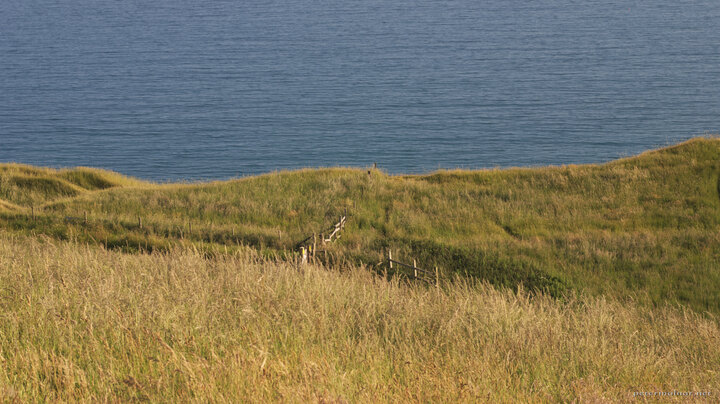

---
author:
    email: mail@petermolnar.net
    image: https://petermolnar.net/favicon.jpg
    name: Peter Molnar
    url: https://petermolnar.net
coordinates:
    latitude: 50.622704
    longitude: -2.272667
copies:
- https://www.flickr.com/photos/36003160@N08/15376351470
- http://web.archive.org/web/20141021002618/https://petermolnar.eu/photo/abstract-shore/
published: '2014-10-18T09:00:26+00:00'
syndicate:
- https://brid.gy/publish/flickr
tags:
- grass
- shore
- United Kingdom
- Durdle Door
- coast
- sea
title: Abstract Shore

---

The original plan for our trip was to visit South Wales, but we decided
to turn South after Cotswolds to get to the sea as fast as possible due
to the very warm summer day. So we ended up visiting the Durdle Door.