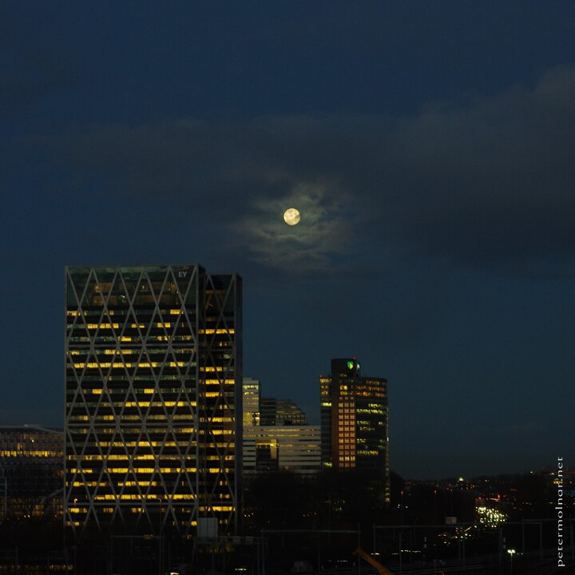

---
author:
    email: mail@petermolnar.net
    image: https://petermolnar.net/favicon.jpg
    name: Peter Molnar
    url: https://petermolnar.net
coordinates:
    latitude: 52.339174
    longitude: 4.892746
copies:
- https://www.flickr.com/photos/36003160@N08/25401544381
- http://web.archive.org/web/20160709134551/https://petermolnar.eu/amsterdam-morning-at-rai/
published: '2016-03-04T10:00:53+00:00'
syndicate:
- https://brid.gy/publish/flickr
tags:
- traffic
- RAI
- moon
- office
- city
- clouds
- Amsterdam
- cars
- morning
- sky
- cityscape
title: Amsterdam - Morning at RAI

---

It may not seem like, but was taken at a morning, when people started
waking up and getting into the city.

I don't usually do this, but I cropped the image a little, dropping the
very bottom of red tail-lights, and the very top of not too significant
blues. Without the red tail lights it gives more of a morning expression
in my opinion.