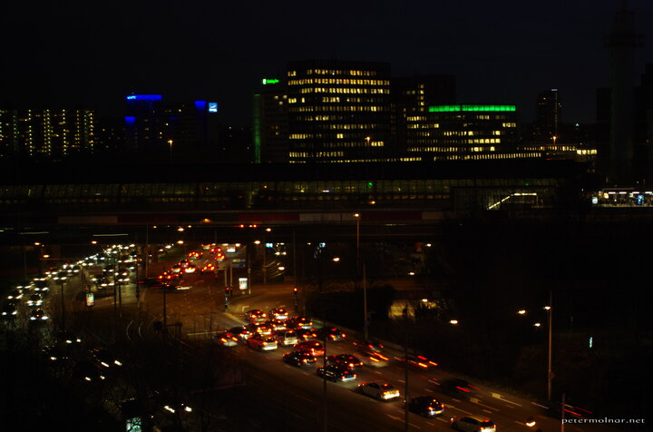

---
author:
    email: mail@petermolnar.net
    image: https://petermolnar.net/favicon.jpg
    name: Peter Molnar
    url: https://petermolnar.net
coordinates:
    latitude: 52.339174
    longitude: 4.892746
copies:
- https://www.flickr.com/photos/36003160@N08/24835228394
- http://web.archive.org/web/20160709134558/https://petermolnar.eu/amsterdam-night-at-rai-2/
published: '2016-03-03T10:00:58+00:00'
syndicate:
- https://brid.gy/publish/flickr
tags:
- traffic
- RAI
- windows
- office
- city
- Amsterdam
- cars
- buildings
- cityscape
- night
title: Amsterdam - Night at RAI 2

---

Same hotel, slightly different view of the RAI station in Amsterdam, at
afternoon rush hour, when everyone is trying to get home in their cars.

The only strange feeling it gives away is that this could be in any big
city, in any country. Is the future ( or the fate ) of cities to lose
their faces except for their very old cores and old towns?