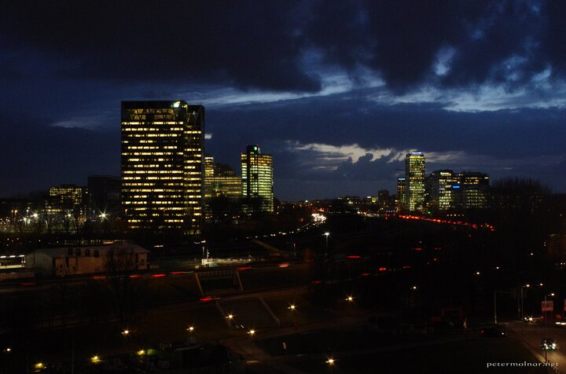

---
author:
    email: mail@petermolnar.net
    image: https://petermolnar.net/favicon.jpg
    name: Peter Molnar
    url: https://petermolnar.net
coordinates:
    latitude: 52.339174
    longitude: 4.892746
copies:
- https://www.flickr.com/photos/36003160@N08/24808777323
- http://web.archive.org/web/20160709134555/https://petermolnar.eu/amsterdam-night-at-rai/
published: '2016-03-02T10:00:57+00:00'
syndicate:
- https://brid.gy/publish/flickr
tags:
- traffic
- RAI
- windows
- office
- city
- clouds
- Amsterdam
- cars
- evening
- buildings
- sky
- cityscape
- night
title: Amsterdam - Night at RAI

---

On my last visit to Amsterdam I stayed at a different location, much
further from the central I usually do. I wasn't expecting to have a
view, but for my surprise, I got this.

Much city. Such sky. Wow.