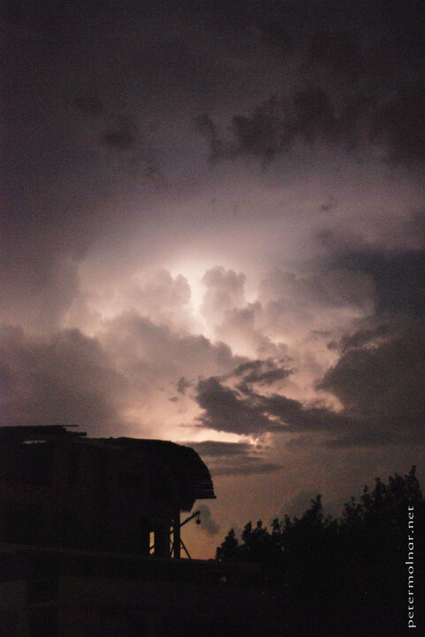

---
author:
    email: mail@petermolnar.net
    image: https://petermolnar.net/favicon.jpg
    name: Peter Molnar
    url: https://petermolnar.net
copies:
- https://www.flickr.com/photos/36003160@N08/15058687459
- http://web.archive.org/web/20141014092856/https://petermolnar.eu/photo/angry-gods/
published: '2014-09-15T09:00:28+00:00'
syndicate:
- https://brid.gy/publish/flickr
tags:
- thunder
- lightning
- clouds
- storm
- thunderstorm
title: Angry Gods

---

I've been in storms, seen storms; many kind of them, but not ever before
or since one like this. The clouds where shining, like strobes or light
bulbs, without a sound. It was terrifying and magnificent at the same
time ( and also impossible to photograph it correctly ).