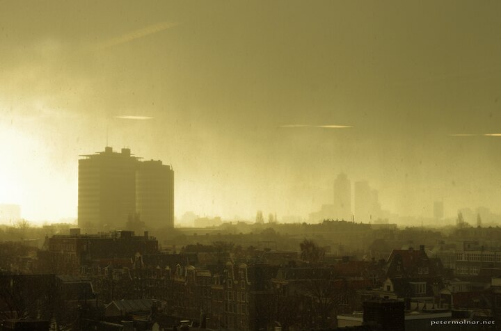

---
author:
    email: mail@petermolnar.net
    image: https://petermolnar.net/favicon.jpg
    name: Peter Molnar
    url: https://petermolnar.net
coordinates:
    latitude: 52.362792
    longitude: 4.891726
copies:
- https://www.flickr.com/photos/36003160@N08/25286009550
- http://web.archive.org/web/20190624125200/https://petermolnar.net/apocalypse/
published: '2016-03-07T10:00:19+00:00'
syndicate:
- https://brid.gy/publish/flickr
tags:
- eerie
- apocalypse
- strange
- storm
- sun
- mysterious
- lights
- snow
- morning
- Amsterdam
title: Apocalypse

---

Starting the day with brilliant sunshine, arriving in the office café to
have your first coffee of the day, just to look outside and see rain,
quickly turning into snow while still having the sun in the back - I'm
not convinced this is normal weather.