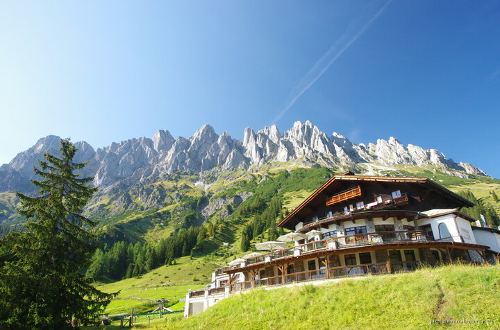

---
author:
    email: mail@petermolnar.net
    image: https://petermolnar.net/favicon.jpg
    name: Peter Molnar
    url: https://petermolnar.net
coordinates:
    latitude: 47.409328
    longitude: 13.128629
copies:
- https://www.flickr.com/photos/36003160@N08/21078459403
- http://web.archive.org/web/20190624125202/https://petermolnar.net/arthurhaus-am-murmeltierweg/
published: '2015-09-25T09:29:44+00:00'
syndicate:
- https://brid.gy/publish/flickr
tags:
- bright
- sunshine
- blue
- green
- summer
- Murmeltierweg
- mountain
- mountains
- Austria
- sky
- altitude
- Alps
title: Hütte am Murmeltierweg

---

> About 20 years ago was a marmot couple, probably the
> great-grandparents of today's residents live in the lush green lawn
> more attractive than in the barren sheep pasture of Mandlwand. The two
> dug the first building under the marked on photo stone and wintered
> there. Two years later, young hired. Since this stone was completely
> undermined, and chosen as the "winter construction" of the whole
> family, in the summer it serves as a popular rock climbing and lookout
> for young and old.