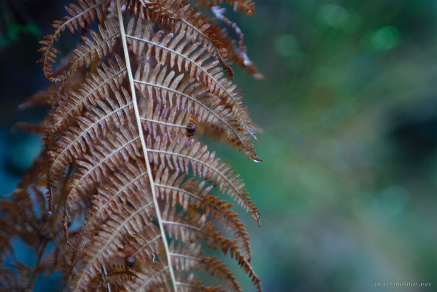

---
author:
    email: mail@petermolnar.net
    image: https://petermolnar.net/favicon.jpg
    name: Peter Molnar
    url: https://petermolnar.net
coordinates:
    latitude: 53.492526
    longitude: -1.825017
copies:
- https://www.flickr.com/photos/36003160@N08/15750775007
- http://web.archive.org/web/20150503024441/https://petermolnar.eu/photo/autumn-fern/
published: '2014-12-03T09:00:43+00:00'
syndicate:
- https://brid.gy/publish/flickr
tags:
- fern
- Peak District
- autumn
title: Autumn fern

---

We visited the very middle of the Peak District in the middle of
November, hoping that there are still a few, bright autumn colour trees
around - we were wrong. By this time of the years the Peak District is
already in the winter state, so instead of photographing autumn trees we
ended up photographing what we could. I was using my Jupiter 9 85mm f/2
old, manual, Russian lens.