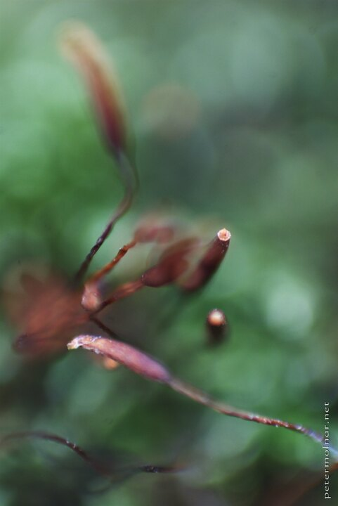

---
author:
    email: mail@petermolnar.net
    image: https://petermolnar.net/favicon.jpg
    name: Peter Molnar
    url: https://petermolnar.net
coordinates:
    latitude: 47.492344
    longitude: 19.0359
copies:
- https://www.flickr.com/photos/36003160@N08/14924971542
- http://web.archive.org/web/20140918231331/https://petermolnar.eu/photo/autumn-impressions-blooming-moss/
published: '2010-10-20T18:00:00+01:00'
syndicate:
- https://brid.gy/publish/flickr
tags:
- moss
- flower
- autumn
- impression
title: Autumn Impressions - Blooming moss

---

"Flowers" of a moss. I brought my camera with me to work a few times
when I walked from the office through a hill in Budapest; I've found
these on a small fence.