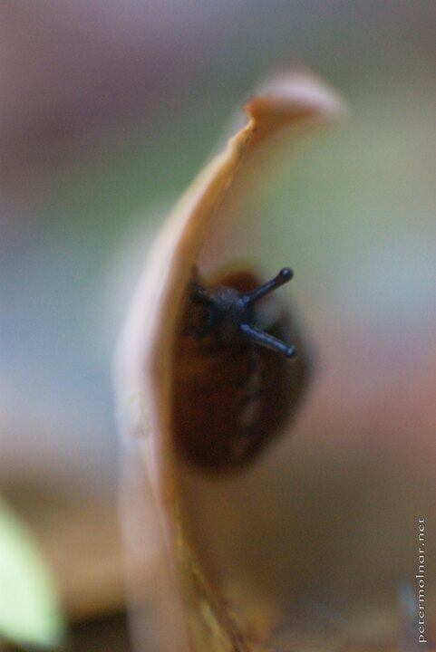

---
author:
    email: mail@petermolnar.net
    image: https://petermolnar.net/favicon.jpg
    name: Peter Molnar
    url: https://petermolnar.net
coordinates:
    latitude: 47.492344
    longitude: 19.0359
copies:
- https://www.flickr.com/photos/36003160@N08/14915698175
- http://web.archive.org/web/20140920020933/https://petermolnar.eu/photo/autumn-impressions-peeking-snail/
published: '2010-10-18T18:00:00+01:00'
syndicate:
- https://brid.gy/publish/flickr
tags:
- snail
- autumn
- impression
- hide
- look
title: Autumn Impressions - Peeking snail

---

One of my previous workplaces was located very close to Tabán in
Budapest and sometimes I walked a fair distance to clear my head. There
was a location during the walk where I regularly saw moss and small
snails so I decided to take my camera with me a few times. I was
fortunate enough to come across this small snail, hiding. When you're
just a few centimeters from them they are much faster than from a
distance :)