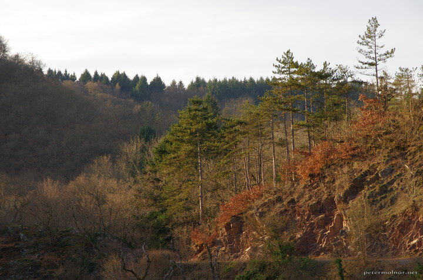

---
author:
    email: mail@petermolnar.net
    image: https://petermolnar.net/favicon.jpg
    name: Peter Molnar
    url: https://petermolnar.net
coordinates:
    latitude: 50.206289
    longitude: 7.33641
copies:
- https://www.flickr.com/photos/36003160@N08/25310345886
- http://web.archive.org/web/20190624125215/https://petermolnar.net/autumn-in-february/
published: '2016-02-28T10:00:38+00:00'
syndicate:
- https://brid.gy/publish/flickr
tags:
- Germany
- sunset
- forest
- Castle Eltz
- pine
- February
title: Autumn in February

---

Even though this view looks very much like it's an autumn scene it was
taken in February. The trick is in the temperature: it was way too warm
for a February, much like you'd expect from October, so it resulted in a
similar toned forest around sunset.