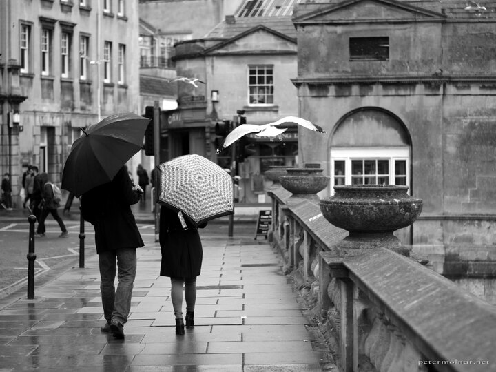

---
author:
    email: mail@petermolnar.net
    image: https://petermolnar.net/favicon.jpg
    name: Peter Molnar
    url: https://petermolnar.net
coordinates:
    latitude: 51.382527
    longitude: -2.357765
copies:
- https://www.flickr.com/photos/36003160@N08/17190684609
- http://web.archive.org/web/20160709134625/https://petermolnar.eu/bath-moment/
published: '2015-05-05T08:05:02+00:00'
syndicate:
- https://brid.gy/publish/flickr
tags:
- umbrella
- Bath
- black and white
- rain
- seagull
- street
title: Bath moment

---

Bath is an interesting city - it's unreal compared to the rest of
England, out of place and feels truly ancient. ( Not a big surprise,
knowing that is still keeping the original, Roman street layout in the
old town. )

This is just a small, everyday scene from there.