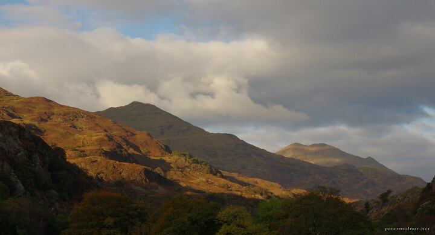

---
author:
    email: mail@petermolnar.net
    image: https://petermolnar.net/favicon.jpg
    name: Peter Molnar
    url: https://petermolnar.net
coordinates:
    latitude: 53.0090948904194
    longitude: -4.10189664539694
copies:
- https://www.flickr.com/photos/36003160@N08/35648390416
- http://web.archive.org/web/20190624125230/https://petermolnar.net/beddgelert/
published: '2017-01-08T10:00:00+00:00'
syndicate:
- https://brid.gy/publish/flickr
tags:
- hills
- autumn
- sunset
- mountain
- clouds
- Wales
- Beddgelert
title: Beddgelert

---

Our third visit to Wales was in autumn, and though I've not yet been
there during winter, I can safely state it's always beautiful.
Beddgelert is a small community; the name of the place originates from a
sad story of a heroic dog. It can offer you magnificent views of the
local mountains and hills so don't miss it if you're close.