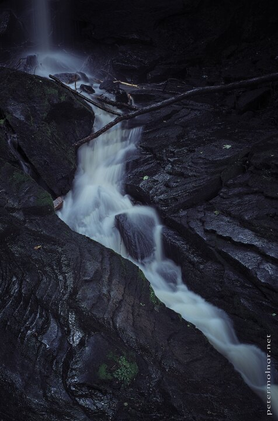

---
author:
    email: mail@petermolnar.net
    image: https://petermolnar.net/favicon.jpg
    name: Peter Molnar
    url: https://petermolnar.net
coordinates:
    latitude: 53.141602
    longitude: -1.533848
copies:
- https://www.flickr.com/photos/36003160@N08/19814557862
- http://web.archive.org/web/20190624125231/https://petermolnar.net/bentley-brook-lumsdale/
published: '2015-07-19T09:00:04+00:00'
syndicate:
- https://brid.gy/publish/flickr
tags:
- Bentley Brook
- long exposure
- Lumsdale
- stream
- summer
- forest
- United Kingdom
- Peak District
- waterfall
- Matlock
- water
title: Bentley Brook, Lumsdale

---

Trying to capture water is tricky, since many of us will fall into the
trap of too long exposure. I've seen brilliant, multi-long-exposure
photographs, which I'm way to far to master at this point, but the
not-too-long exposure I'm getting slightly better with. What surprised
me after taking this shoot is the focal length I made it with: 43mm. The
16-85 zoom gives you plenty of options, yet I ended up very close to my
usual weapon of choice, 50mm (75mm eq. since I'm on APS-C), and I also
ended up with a focal length that used to exist for Pentax as a prime.