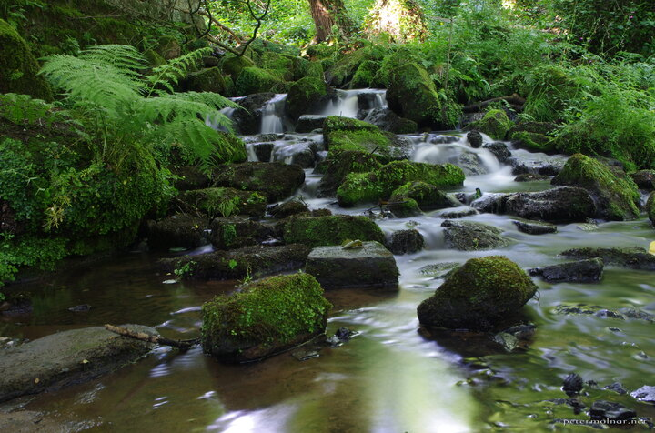

---
author:
    email: mail@petermolnar.net
    image: https://petermolnar.net/favicon.jpg
    name: Peter Molnar
    url: https://petermolnar.net
coordinates:
    latitude: 53.140882
    longitude: -1.534363
copies:
- https://www.flickr.com/photos/36003160@N08/19229385564
- http://web.archive.org/web/20190624125233/https://petermolnar.net/bentley-brook/
published: '2015-07-20T00:00:09+00:00'
syndicate:
- https://brid.gy/publish/flickr
tags:
- Bentley Brook
- long exposure
- Lumsdale
- stream
- summer
- forest
- United Kingdom
- Peak District
- waterfall
- Matlock
- water
title: Bentley Brook

---

Unfortunately the UK is not famous for endless forests and
low-population dense areas - yet, there are many small, hidden and
beautiful places. There is a small valley in Matlock, which used to be a
quite heavy industrial area in the Victorian age; ruins and beautiful
scenery today.

Mindemellett olyan, mintha megtaláltuk volna Anglia Börzsönyét, és
akármilyen kicsi is, ez egy meglehetősen jó érzés.