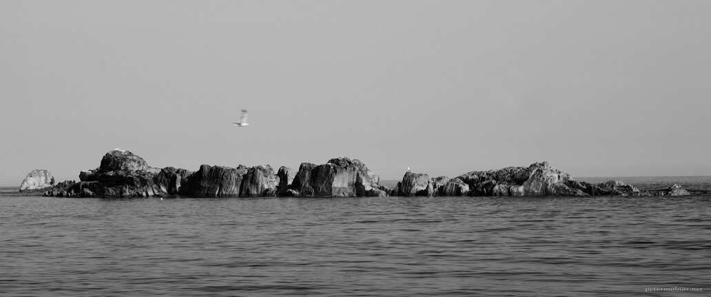

---
author:
    email: mail@petermolnar.net
    image: https://petermolnar.net/favicon.jpg
    name: Peter Molnar
    url: https://petermolnar.net
coordinates:
    latitude: 50.62158
    longitude: -2.27783
copies:
- https://www.flickr.com/photos/36003160@N08/17933935556
- http://web.archive.org/web/20190624125241/https://petermolnar.net/birds-rocks-sea/
published: '2015-05-22T08:06:35+00:00'
syndicate:
- https://brid.gy/publish/flickr
tags:
- rock
- rocks
- landscape
- outdoor
- fly
- black and white
- bird
- sea
- black & white
- seagull
title: Birds, Rocks, Sea

---

I've spotted these rocks at the Durdle Door - it was not even our
original destination, but we picked the Day of the British Summer for
our journey, which is surprisingly hot, so we ended up next to the sea.
The truth is: I had this picture for 2 years and I couldn't figure out
what it needs to be actually interesting, until I started cropping. The
key was in the aspect ratio: there was just too much sky and water
originally, due to the 3:2, APS-C format. Don't be afraid to cut your
images sometimes; there are subjects which needs different aspect
ratios.