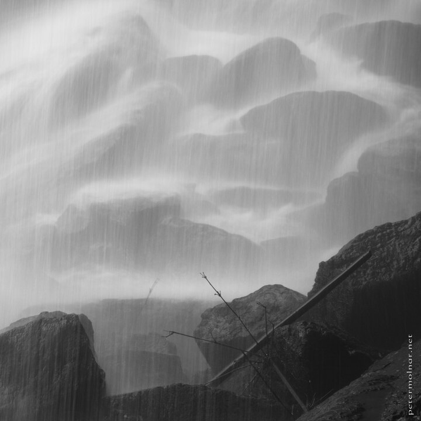

---
author:
    email: mail@petermolnar.net
    image: https://petermolnar.net/favicon.jpg
    name: Peter Molnar
    url: https://petermolnar.net
coordinates:
    latitude: 28.469445
    longitude: 104.992647
copies:
- https://www.flickr.com/photos/36003160@N08/15736022159
- http://web.archive.org/web/20141208001310/https://petermolnar.eu/photo/bw-bottom-of-a-waterfall/
published: '2014-12-01T09:00:26+00:00'
syndicate:
- https://brid.gy/publish/flickr
tags:
- Sichuan
- mist
- bamboo
- waterfall
- China
- Shunan Bamboo Sea
title: B&W - Bottom of a waterfall

---

There is one waterfall in the Shunan Bamboo Sea (蜀南竹海国家公园) where
it's possible to walk behind it; it's definitely a different view and
feeling compared to the front views.