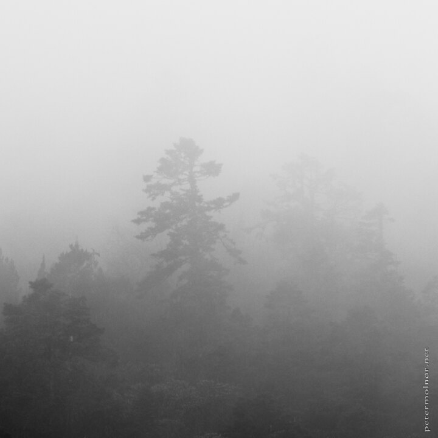

---
author:
    email: mail@petermolnar.net
    image: https://petermolnar.net/favicon.jpg
    name: Peter Molnar
    url: https://petermolnar.net
coordinates:
    latitude: 32.734404
    longitude: 103.831422
copies:
- https://www.flickr.com/photos/36003160@N08/15743531127
- http://web.archive.org/web/20141208064548/https://petermolnar.eu/photo/bw-pines-in-the-mist/
published: '2014-12-02T09:00:20+00:00'
syndicate:
- https://brid.gy/publish/flickr
tags:
- Sichuan
- Huanglong
- autumn
- fog
- mist
- China
title: B&W - pines in the mist

---

Sometimes the rude weather we got in Huanglong (黄龙) lightened up a bit
and showed us the pines on the mountainside.