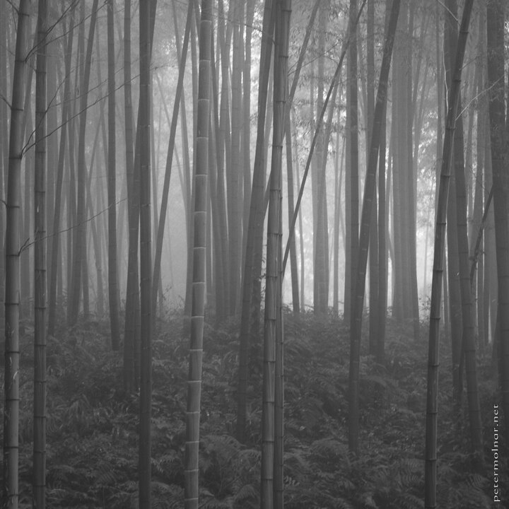

---
author:
    email: mail@petermolnar.net
    image: https://petermolnar.net/favicon.jpg
    name: Peter Molnar
    url: https://petermolnar.net
coordinates:
    latitude: 28.47533
    longitude: 104.994449
copies:
- https://www.flickr.com/photos/36003160@N08/15293114383
- http://web.archive.org/web/20141207191227/https://petermolnar.eu/photo/bw-shunan-bamboo-sea/
published: '2014-11-30T11:50:37+00:00'
syndicate:
- https://brid.gy/publish/flickr
tags:
- bamboo
- China
- Sichuan
- Shunan Bamboo Sea
- mist
title: B&W - Shunan Bamboo Sea

---

During our day in the Shunan Bamboo Sea (蜀南竹海国家公园) we had a
thick fog. From one point of view it was bad that we could not see many
of the marvellous waterfalls but on the other hand the mist gave a
unique, mistique and remote feeling to the place.