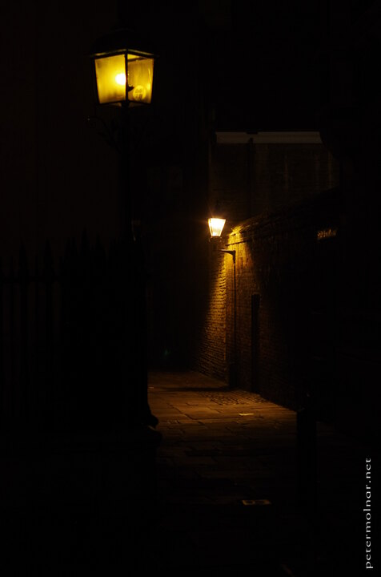

---
author:
    email: mail@petermolnar.net
    image: https://petermolnar.net/favicon.jpg
    name: Peter Molnar
    url: https://petermolnar.net
copies:
- https://www.flickr.com/photos/36003160@N08/35455528700
- http://web.archive.org/web/20190624125253/https://petermolnar.net/cambridge-night-lamps/
published: '2017-07-10T18:00:00+00:00'
syndicate:
- https://brid.gy/publish/flickr
tags:
- England
- lamp
- English
- Cambridge
- old
- night
title: Cambridge night lamps

---

Sometimes, when you live in a beautiful city, you take it for granted,
and overlook all the marvels around you. Unfortunately I barely ever
wonder in the center of Cambridge during night, but at one day it all
felt so perfect, still, quiet, and lightly foggy that despite the
weekday, we took a stroll in the town. It was worth it; we even spotted
an otter in the Cam.