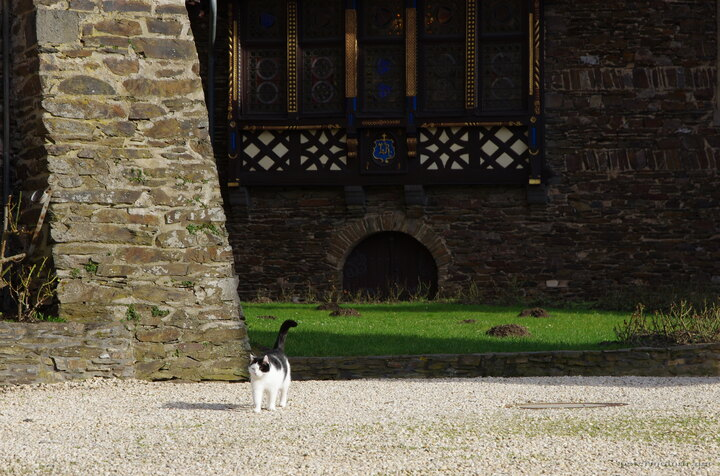

---
author:
    email: mail@petermolnar.net
    image: https://petermolnar.net/favicon.jpg
    name: Peter Molnar
    url: https://petermolnar.net
coordinates:
    latitude: 50.142194
    longitude: 7.167034
copies:
- https://www.flickr.com/photos/36003160@N08/24624819843
- http://web.archive.org/web/20160709134634/https://petermolnar.eu/castle-cat/
published: '2016-02-25T10:00:54+00:00'
syndicate:
- https://brid.gy/publish/flickr
tags:
- cat
- castle
- Germany
- Cochem
- medieval
title: Castle Cat

---

Not knowing the place has a winter 'close' our original goal was
visiting Castle Eltz - when we learnt that entry is not possible,
Nora[^1] started looking for alternatives. This is how we ended up in
Cochem and the Castle of Cochem. This is the cat guarding the castle
who, just like many other cats before, spotted us from the other side of
the area and walked straight to Nora.

[^1]: <https://norahamucska.eu>