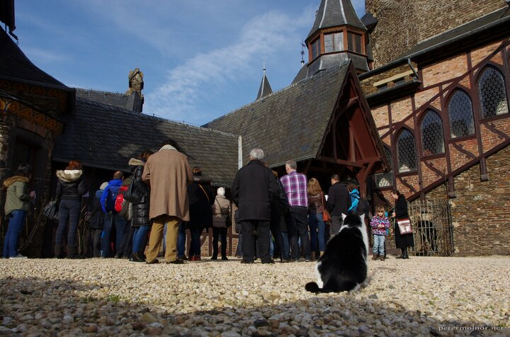

---
author:
    email: mail@petermolnar.net
    image: https://petermolnar.net/favicon.jpg
    name: Peter Molnar
    url: https://petermolnar.net
coordinates:
    latitude: 50.142194
    longitude: 7.167034
copies:
- https://www.flickr.com/photos/36003160@N08/24956126670
- http://web.archive.org/web/20190624125255/https://petermolnar.net/cats-kingdom/
published: '2016-02-25T10:30:55+00:00'
syndicate:
- https://brid.gy/publish/flickr
tags:
- low perspective
- Germany
- medieval
- castle
- Cochem
- cat
title: Cat's Kingdom

---

The cat of Castle Eltz checking up on it's human visitors.