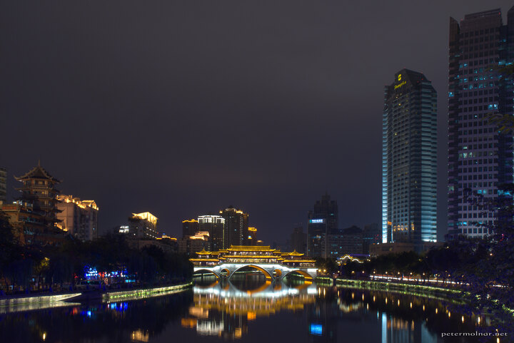

---
author:
    email: mail@petermolnar.net
    image: https://petermolnar.net/favicon.jpg
    name: Peter Molnar
    url: https://petermolnar.net
coordinates:
    latitude: 30.64417
    longitude: 104.083389
copies:
- https://www.flickr.com/photos/36003160@N08/15121792933
- http://web.archive.org/web/20141130053512/https://petermolnar.eu/photo/chengdu-anshun-bridge/
published: '2014-11-08T19:07:21+00:00'
syndicate:
- https://brid.gy/publish/flickr
tags:
- China
- Sichuan
- Chengdu
- cityscape
- Anshun Bridge
- night
title: Anshun Bridge in Chendgu at night

---

We saw the beautiful Anshun Bridge (安顺桥) from the distance from the
bus when we got back to Chendgu (成都) late in the night. Next day we
decided to visit it; during the time we were prepairing to take the
pictures a photographer lady told us that it's much nicer from the other
direction. We followed her through the Halloween-themed party places on
the riverside and I have to admit: it is better from the other
direction.