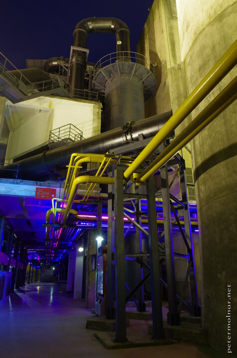

---
author:
    email: mail@petermolnar.net
    image: https://petermolnar.net/favicon.jpg
    name: Peter Molnar
    url: https://petermolnar.net
coordinates:
    latitude: 30.671237
    longitude: 104.12088
copies:
- https://www.flickr.com/photos/36003160@N08/26735549512
- http://web.archive.org/web/20160709134643/https://petermolnar.eu/chengdu-eastern-suburb-memory-2/
published: '2016-04-26T10:00:22+00:00'
syndicate:
- https://brid.gy/publish/flickr
tags:
- cyberpunk
- Sichuan
- future
- People's Republic of China
- futurist
- Chengdu
- 60s
- abandoned
- Eastern Suburb Memory
- industrial
- lights
- art
- 1960
- factory
- evening
- old
- lost future
- China
- LED
- night
title: Eastern Suburb Memory 2

---

Eastern Suburb Memory: an old TV cathode tube factory, converted into an
art and leisure park.

This area was said to be the most authentic part, with all the original
parts. It looks exceptional in the night.