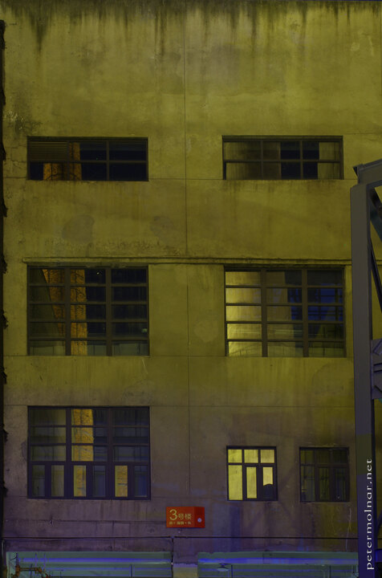

---
author:
    email: mail@petermolnar.net
    image: https://petermolnar.net/favicon.jpg
    name: Peter Molnar
    url: https://petermolnar.net
coordinates:
    latitude: 30.671237
    longitude: 104.12088
copies:
- https://www.flickr.com/photos/36003160@N08/26224022624
- http://web.archive.org/web/20160709134648/https://petermolnar.eu/chengdu-eastern-suburb-memory-3/
published: '2016-04-27T10:00:23+00:00'
syndicate:
- https://brid.gy/publish/flickr
tags:
- cyberpunk
- Sichuan
- future
- People's Republic of China
- futurist
- Chengdu
- 60s
- abandoned
- Eastern Suburb Memory
- industrial
- lights
- art
- 1960
- factory
- evening
- old
- lost future
- China
- LED
- night
title: Eastern Suburb Memory 3

---

Eastern Suburb Memory: an old TV cathode tube factory, converted into an
art and leisure park.

Those are real windows, with glass, not blanks, and the reflections is
about the gigantic chimney behind me. I ended up doing significant
perspective corrections on this image due to not being tens of meters
high.