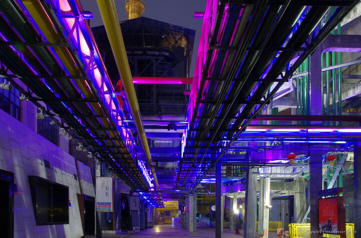

---
author:
    email: mail@petermolnar.net
    image: https://petermolnar.net/favicon.jpg
    name: Peter Molnar
    url: https://petermolnar.net
coordinates:
    latitude: 30.671237
    longitude: 104.12088
copies:
- https://www.flickr.com/photos/36003160@N08/26224048034
- http://web.archive.org/web/20160709134657/https://petermolnar.eu/chengdu-eastern-suburb-memory-5/
published: '2016-04-29T10:00:26+00:00'
syndicate:
- https://brid.gy/publish/flickr
tags:
- cyberpunk
- Sichuan
- future
- People's Republic of China
- futurist
- Chengdu
- 60s
- abandoned
- Eastern Suburb Memory
- industrial
- lights
- art
- 1960
- factory
- evening
- old
- lost future
- China
- LED
- night
title: Eastern Suburb Memory

---

Eastern Suburb Memory: an old TV cathode tube factory, converted into an
art and leisure park.

Sadly, not everything was lively and open: there were areas, like this,
where no one was around and none of the pubs and stores were open. The
scene however was just how you'd imagine any cyberpunk setup, just no
dirt and no trash anywhere.

I had to do some perspective correction here as well.